# Architecture / 架构

## System Overview

```mermaid
graph TD
    subgraph Frontend["Frontend Layer"]
        Web["🌐 Streamlit UI<br/>:8501"]
        CLI["💻 CLI<br/>python -m src.app.cli"]
        API["🔌 FastAPI REST<br/>:8000 + Swagger"]
    end

    subgraph Orchestrator["Orchestration Layer"]
        LG["LangGraph<br/>plan → execute(并行) → review → fix → verify"]
        HC["Hardcoded Pipeline<br/>Planner → Executor → Reviewer"]
        SK["Agent Skills<br/>roles + triggers 筛选"]
    end

    subgraph Agent["Agent Harness Layer"]
        EL["Execution Loop<br/>while turn &lt; max_turns"]
        SP["Streaming Parser<br/>state machine for JSON"]
        SB["Sandbox<br/>process isolation"]
        TL["Telemetry<br/>JSON Lines logger"]
    end

    subgraph Tools["Tools Layer"]
        T1["read_file"]
        T2["list_files"]
        T3["grep_pattern"]
        T4["run_command"]
        T5["clone_repo"]
        T6["get_diff"]
        T7["search_code"]
    end

    subgraph Data["Data Layer"]
        DB["SQLite WAL<br/>sessions/messages/findings/logs"]
        VS["FTS5 Search<br/>paragraph-indexed"]
    end

    subgraph Infra["Infrastructure"]
        PM["Prometheus /metrics"]
        JW["JWT Auth + Rate Limit"]
        CI["GitHub Actions CI"]
        MC["LLM Cache + Model Router"]
        HL["HITL Guard"]
    end

    Web --> LG
    Web --> HC
    CLI --> LG
    CLI --> HC
    API --> LG
    API --> HC
    LG --> EL
    SK --> LG
    HC --> EL
    EL --> SP
    EL --> SB
    EL --> TL
    EL --> T1
    EL --> T2
    EL --> T3
    EL --> T4
    EL --> T5
    EL --> T6
    EL --> T7
    EL --> DB
    EL --> VS
    API --> PM
    API --> JW
    API --> CI
    EL --> MC
    EL --> HL
```



## Data Flow

```
User Input → Router (select model)
           → Cache Check (return cached if hit)
           → Agent Harness (Execution Loop)
              → Tool Call → HITL Check → Execute → Result
           → FTS5 Index (paragraph-level)
           → SQLite Persist (sessions/messages/findings/logs)
           → Stream Response to UI
```

## Multi-Agent Pipeline (LangGraph)

```
plan (Planner: list/read/grep)
  │
  ├── findings = 0 → END
  │
  └── findings > 0 → Send fan-out（每条 finding 一个并行节点）
        │
        ├── execute_1  ─┐
        ├── execute_2  ─┤  并行验证，verdicts 自动累加
        ├── ...        ─┤  (operator.add reducer)
        └── execute_N  ─┘
        │
        ▼
review (去重合并，生成报告)
  │
  ├── 无 CONFIRMED → END
  │
  └── 有 CONFIRMED → Send fan-out（按文件分组）
        │
        └── fix_文件A ─┐
        └── fix_文件B ─┤  同文件合并串行修复（防互相覆盖）
        └── ...       ─┤  写前自动备份 .bak
        │
        ▼
verify_fix (语法检查 + 修复统计) → END
```

## Agent Skills 注入

`LangGraphOrchestrator` 在构造时从 `<repo>/skills/*/SKILL.md` 加载技能包，并在每轮
`run(task, project_path)` 开始时为 `planner`、`executor`、`reviewer`、`fixer` 计算注入块。
一个技能正文被注入的条件是：`roles` 为空或包含当前角色，且 `triggers` 为空或至少一个关键词
命中任务文本（忽略大小写）。角色可用技能索引始终保留，完整正文只在关键词命中时追加。

CLI 的 `--skills-dir` 优先级最高；未指定时工厂依次使用 `SKILLS_DIR` 和仓库默认 `skills/`。
Streamlit、FastAPI 和 CLI Multi-Agent 都通过同一个工厂创建编排器，因此选择规则一致。详情见
[skills 使用说明](skills.md)。

## Tech Stack

| Layer | Technology |
|-------|-----------|
| Agent Runtime | Python 3.9+, hand-written Execution Loop |
| Multi-Agent | LangGraph StateGraph (plan → execute并行 → review → fix → verify) + Hardcoded Pipeline |
| LLM | DeepSeek (Anthropic-compatible API) |
| Database | SQLite WAL + FTS5 Full-Text Search |
| API | FastAPI + Swagger + Prometheus + JWT + Rate Limit |
| UI | Streamlit (Claude Code style) |
| DevOps | Docker + GitHub Actions CI |
| Testing | pytest 12 tests, pytest-cov |
