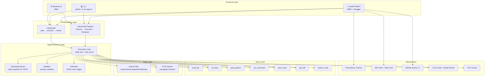

# Architecture / 架构

## System Overview



## Data Flow

```
User Input → Router (select model)
           → Cache Check (return cached if hit)
           → Agent Harness (Execution Loop)
              → Tool Call → HITL Check → Execute → Result
           → FTS5 Index (paragraph-level)
           → SQLite Persist (sessions/messages/findings/logs)
           → Stream Response to UI
```

## Tech Stack

| Layer | Technology |
|-------|-----------|
| Agent Runtime | Python 3.9+, hand-written Execution Loop |
| Multi-Agent | LangGraph StateGraph + Hardcoded Pipeline |
| LLM | DeepSeek (Anthropic-compatible API) |
| Database | SQLite WAL + FTS5 Full-Text Search |
| API | FastAPI + Swagger + Prometheus + JWT + Rate Limit |
| UI | Streamlit (Claude Code style) |
| DevOps | Docker + GitHub Actions CI |
| Testing | pytest 12 tests, pytest-cov |
