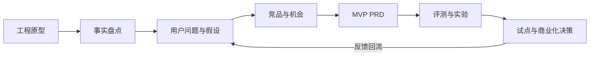
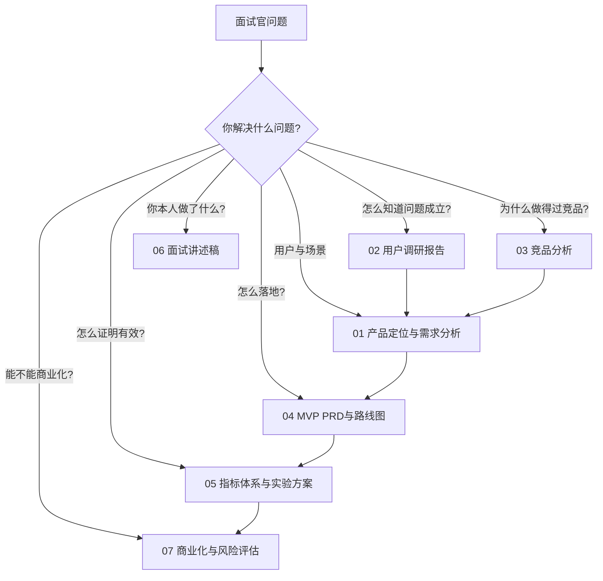

# 事实基线与作品集说明

## 1. 这份作品集要证明什么

这不是把工程代码改写成产品宣传稿，而是展示一名 AI 产品经理如何把一个技术原型转化为可验证的产品方案：

作品集中的每一个结论都应能回答三个问题：事实从哪里来、假设如何验证、如果验证失败如何调整。

## 2. 当前项目已经实现的能力

| 能力 | 项目证据 | 可以转译成的产品能力 | 不能夸大的部分 |
|---|---|---|---|
| 多 Agent 编排 | `src/multi_agent/`、`docs/architecture.md` | 发现、验证、汇总、修复、验证的工作流 | 尚未等同于成熟 PR 产品体验 |
| 工具与执行循环 | `src/harness/`、`src/tools/` | 读取代码、搜索、命令执行、受控写入 | 生产级容器隔离和多租户仍需补齐 |
| 安全控制 | JWT、HITL Guard、sandbox、限流相关实现 | 权限、审批、审计和危险动作控制 | 仍需企业 SSO、密钥托管、合规证明 |
| 评测体系 | `docs/agent-evaluation-plan.md`、`tests/eval/`、`reports/` | 质量、轨迹、故障归因、稳定性和成本度量 | 真实全量 replay 与真实客户 ROI 尚未完成 |
| 多入口 | Streamlit、CLI、FastAPI | Web、命令行、API 使用方式 | GitHub/GitLab OAuth、Webhook 属于产品化规划 |
| 反馈与报告基础 | finding、verdict、review report、telemetry | 发现卡片、状态、反馈、趋势面板 | 用户研究和连续使用数据尚未建立 |

## 3. 评测事实与边界

截至仓库评测文档记录：

- 标注集共 124 条，包含 108 条正例和 16 条 FP 陷阱；正确目标项目的文件匹配率为 124/124。
- 离线故障注入集 10/10 通过，健康链路门禁曾记录工具调用成功率和端到端成功率 100%。这只能说明测试链路在该批样本上通过。
- 真实 replay 运行到 77/124 后暂停；报告中的部分样本 Precision 95.5%、Recall 27.6%、F1 0.43 不得外推为完整模型基线。
- 旧日志基线中存在大量未收尾运行，评测计划明确将其视为采集覆盖缺口，不能直接归因给模型失败。
- 当前尚未完成真实客户访谈、真实 PR 试点、完整自动修复质量评测和长期 ROI 证明。

对应证据入口：

- [系统架构](../architecture.md)：入口、编排、Harness、工具和数据层。
- [评测实施方案](../agent-evaluation-plan.md)：数据集、指标、失败分类、阶段状态和明确缺口。
- [评测报告目录](../../reports/)：离线、基线和真实链路产物；阅读时以报告中的样本范围和备注为准。
- [测试目录](../../tests/)：功能、遥测、故障注入与评测自测代码。

## 4. 作品集阅读地图

## 5. 面试中建议使用的表述

推荐说：“我把已有工程能力抽象成一个待验证的产品方案，并明确区分实现事实、行业观察和产品假设。”

不推荐说：“已经有大量客户使用、准确率达到某个固定值、已经支持 GitHub PR 自动审查。”除非后续确实完成对应试点并把证据补入仓库。

## 6. 继续补证的优先顺序

1. 完成 10～14 人访谈并留存匿名研究记录。
2. 用同一脱敏仓库完成竞品实测矩阵。
3. 做只读 PR 原型，观察首结果时延、证据理解和反馈率。
4. 完成完整评测 replay、重复运行稳定性和自动修复质量评测。
5. 用至少 3 个团队的两周试点数据更新商业化判断。
