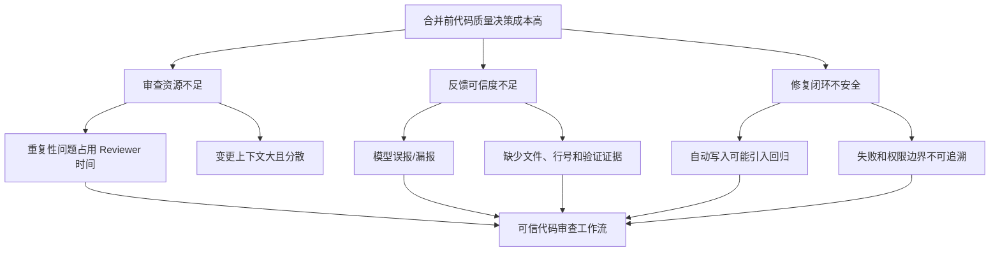
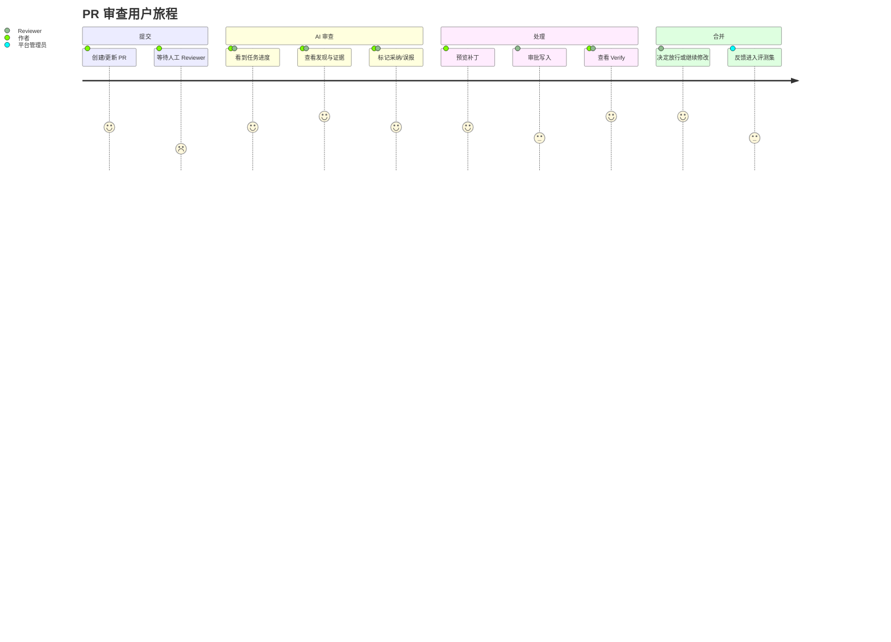
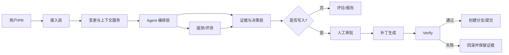

# 产品定位与需求分析

## 1. 产品背景

代码审查是研发交付中的质量闸门，但传统审查存在三个结构性问题：审查时间与开发节奏错位、重复性问题消耗高级工程师、评论缺少可复现证据导致作者不信任。大语言模型能够扩大审查覆盖，但如果直接把模型接到代码仓库，容易出现误报、漏报、上下文不足和不安全自动修改。

本项目已有的技术基础包括：多 Agent 分工（Planner、Executor、Reviewer、Fixer、Verify）、代码读取与搜索工具、LangGraph 编排、JWT 与限流、遥测，以及离线/真实链路评测。这些能力适合被产品化为“可信代码审查工作流”，而不是泛化的聊天机器人。

## 2. 目标用户与场景

### 2.1 目标市场（ICP）

首个目标市场是 20～300 人、采用 GitHub/GitLab Pull Request 流程、没有专职代码质量平台团队的研发组织。典型团队愿意使用 SaaS，也可能因源代码敏感而要求私有化部署。

### 2.2 用户分层

| 用户 | 核心任务 | 当前痛点 | 成功标准 |
|---|---|---|---|
| 代码作者 | 在提交/合并前发现问题 | 等待人工审查、来回沟通 | 10 分钟内得到可操作反馈 |
| Reviewer/Tech Lead | 快速判断是否值得阻塞合并 | 重复看低风险问题、上下文切换 | 只处理高价值和高风险问题 |
| 研发经理 | 控制质量与交付速度 | 无法量化审查收益 | 看到缺陷拦截、采纳率和时延趋势 |
| 安全/平台管理员 | 控制数据与执行权限 | 代码外泄、自动修改失控 | 权限、审计、部署边界可配置 |

### 2.3 JTBD

> 当我准备合并一个变更时，我希望快速获得带代码证据、风险等级和修复建议的审查结果，以便在不增加 Reviewer 负担的前提下决定是否修改或放行。

## 3. 问题陈述与价值假设

**问题陈述**：研发团队不是缺少“能生成评论的模型”，而是缺少一个能在真实仓库约束下稳定完成“取上下文—提出问题—验证证据—给出决策—安全修复”的系统。

**价值假设**：如果系统只推送经过二次验证、带证据链的高置信问题，并将自动修复设置为可审批动作，那么团队会比使用单轮代码问答更愿意把它接入合并流程。

**风险假设**：误报会比漏报更快损害信任；未经审批的写入、敏感代码外发和结果不可追溯是企业采用的硬门槛。

## 4. 产品定位与差异化

### 定位

可信代码审查 Agent：以变更集为中心，输出可验证发现；以人工审批为边界，提供安全修复；以评测和遥测为基础，持续优化质量与成本。

### 差异化支柱

1. **证据优先**：每条发现必须关联文件、行号、上下文和验证结论，降低“模型说了算”。
2. **工作流优先**：Planner 发现、Executor 验证、Reviewer 汇总、Fixer 修复、Verify 回归，产品体验围绕 PR 决策而非聊天轮次。
3. **可控执行**：只读审查默认开启；写入、命令执行和外部网络访问按风险分级并支持人工确认。
4. **可度量**：同时跟踪 Precision、Recall、采纳率、误报率、延迟、Token 成本和修复回归率。

## 5. 需求池与优先级

优先级采用 `RICE` 的简化版：Reach（影响用户数）、Impact（对核心价值的影响）、Confidence（证据可信度）、Effort（工程成本）。本阶段只做定性分级，避免伪造未经验证的精确分数。

| 需求 | 用户价值 | 风险 | 优先级 | 依据 |
|---|---|---|---|---|
| PR/Commit 变更集接入 | 让审查进入真实工作流 | 需 GitHub/GitLab 权限 | P0 | 当前仅支持本地路径，产品化必需 |
| 发现卡片：等级、证据、建议、状态 | 让用户可判断、可行动 | 结果格式需稳定 | P0 | 当前已有 finding/verdict/report 结构 |
| 只读审查与人工确认 | 保护仓库和用户信任 | 增加一步交互 | P0 | 当前已有 HITL 与写入安全约束 |
| 一键生成修复补丁并预览 diff | 缩短闭环 | 可能引入回归 | P0 | 当前已有 Fixer/Verify 能力，需产品化 |
| 忽略/采纳/误报反馈 | 形成个性化质量闭环 | 反馈标签可能不一致 | P1 | 评估数据需要持续补充 |
| 仓库规则与风险策略 | 支持团队差异 | 配置复杂度上升 | P1 | 企业采用的控制面 |
| CI 阻塞门禁 | 让结果可进入质量流程 | 误阻塞带来高风险 | P1 | 需先建立稳定的质量门槛 |
| 组织级权限、SSO、审计 | 支持企业部署 | 研发与合规投入大 | P2 | 企业级差距文档已列明 |
| 多模型路由与成本预算 | 质量/成本可控 | 模型差异需要持续评测 | P2 | 当前已有模型路由基础 |

## 6. 核心用户流程

```text
连接代码仓库 → 选择 PR/Commit → 系统读取变更及必要上下文
→ Planner 发现候选问题 → Executor 验证证据
→ Reviewer 去重、分级并生成报告 → 用户采纳/忽略/查看证据
→ 用户审批后生成补丁 → Verify 执行测试/静态检查
→ 回写 PR 评论与质量结果 → 反馈进入评测集
```

## 7. 非目标

- 不把产品定位为通用代码生成或 IDE 全能助手。
- MVP 不承诺替代人工安全审计、架构评审或发布审批。
- 不默认对生产仓库直接写入；任何写入必须显式授权并可回滚。
- 不用单一 LLM 裁判分数代替真实用户反馈和规则校验。

## 8. 成功标准（首个可验证版本）

- 至少 5 个目标团队完成真实 PR 试用，其中 3 个团队连续使用两周。
- P0 流程的结果可追溯率 ≥ 95%，即每条展示的发现都有文件/行号/证据。
- 用户标记为“有帮助”的发现占比 ≥ 60%；误报反馈 ≤ 20%。
- P95 首次结果时延 ≤ 5 分钟；重复审查命中缓存时延 ≤ 30 秒。
- 自动修复不以“生成成功”为成功，而以 Verify 通过且无新增失败为成功。

## 9. 问题树与产品机会



产品机会不是“再做一个聊天入口”，而是把每个高风险问题转化为可核验、可处理、可回滚的决策单元。

## 10. 场景优先级

| 场景 | 触发时机 | 用户任务 | 首版处理 | 不做的事 |
|---|---|---|---|---|
| PR 增量审查 | 新建或更新 PR | 判断是否存在阻塞级问题 | 只读审查、证据卡、回写评论 | 不扫描全仓库作为默认行为 |
| 合并前修复 | 用户采纳发现 | 生成并核验补丁 | diff 预览、人工审批、Verify | 不直接覆盖用户分支 |
| 历史问题复盘 | 线上缺陷或误报关闭后 | 将案例沉淀为评测样本 | 反馈标签、回归集、趋势统计 | 不自动把所有反馈当真值 |
| 组织策略治理 | 团队接入后 | 配置严重度、权限、保留策略 | P1 提供规则和审计 | 不在 MVP 做复杂 RBAC |

## 11. 用户旅程与产品触点



## 12. RICE 定性评分口径

为了避免“拍脑袋排优先级”，在真实数据补齐前使用 1～5 级定性评分：

| 维度 | 1 分 | 3 分 | 5 分 |
|---|---|---|---|
| Reach | 只影响少数管理员 | 影响一个团队 | 影响所有 PR 参与者 |
| Impact | 体验优化 | 明显减少人工判断 | 直接影响质量或核心转化 |
| Confidence | 只有个人判断 | 有项目证据或少量访谈 | 多角色行为证据/线上数据 |
| Effort | 小于 1 人日 | 1～2 周 | 跨系统、跨团队或企业能力 |

`优先级参考值 = Reach × Impact × Confidence ÷ Effort`，但在样本不足时只用于排序，不作为精确商业预测。当前 P0 的共性是直接影响“第一次只读审查是否能完成并被信任”。

## 13. 产品与技术边界



产品层只向用户暴露任务、发现、证据、补丁和验证状态；Planner、Executor 等内部角色属于实现与运维层，不能直接成为用户必须理解的操作概念。

## 14. 需求决策记录

| 决策 | 选择 | 放弃方案 | 原因 | 重新评估条件 |
|---|---|---|---|---|
| 首版入口 | PR 增量审查 | 全仓库聊天 | 更贴近合并决策，成本边界清晰 | 访谈显示用户主要需要 IDE 即时反馈 |
| 默认权限 | 只读 | 自动写入 | 误写风险和信任成本更低 | Verify 通过率稳定且用户主动要求自动应用 |
| 结果展示 | 证据卡 | 长篇 Agent 思维过程 | 更利于快速判断，避免暴露内部不稳定文本 | 可用性测试证明用户需要更深层解释 |
| 质量门禁 | 先软提醒后阻塞 | MVP 直接阻塞合并 | 先建立误报基线，降低组织风险 | 高危场景 Precision 和稳定性达到门槛 |
