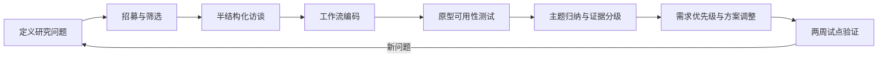

# 用户调研报告

## 1. 研究说明

本报告是面向产品化决策的研究设计与阶段性洞察，不把尚未发生的访谈写成既成事实。当前结论分为三类：

- **已有事实**：来自项目代码、测试、评估报告和现有使用记录。
- **行业观察**：来自公开产品形态和研发工作流的常识性观察，需在正式调研中复核。
- **待验证假设**：需要通过访谈、可用性测试或行为数据确认。

## 2. 研究目标

1. 识别代码审查中最值得交给 Agent 的任务边界。
2. 找出用户判断“这条发现可信”的证据和交互要求。
3. 了解误报、漏报、数据安全、自动修改对采用意愿的影响。
4. 为 MVP 的接入方式、通知时机和付费对象提供决策依据。

## 3. 研究问题与假设

| 研究问题 | 待验证假设 | 验证方法 |
|---|---|---|
| 用户最痛的审查环节是什么？ | 重复性低风险评论比复杂架构问题更适合首批自动化 | 8～12 次半结构化访谈 |
| 什么样的证据能建立信任？ | 文件/行号 + 最小上下文 + 可复现命令比自然语言解释更有效 | 原型可用性测试 |
| 用户是否愿意自动修复？ | 用户愿意“生成补丁”，但不愿意无审批直接写入 | 场景实验与选择题 |
| 什么会导致关闭工具？ | 连续误报、阻塞错误合并、审查耗时不可预测 | 访谈 + 日志分析 |
| 谁是付费决策者？ | 研发负责人关注节省时间，平台/安全负责人关注控制和数据边界 | 角色对照访谈 |

## 4. 目标样本

建议首轮招募 10～14 人，覆盖以下结构，而不是只访谈熟悉 AI 的朋友：

| 样本 | 数量 | 筛选条件 |
|---|---:|---|
| 代码作者 | 4 | 每周至少提交 2 个 PR |
| Reviewer/Tech Lead | 4 | 每周审查 5 个以上 PR |
| 研发经理 | 2 | 对交付质量或效率负责 |
| 平台/安全人员 | 2 | 负责 CI、权限或源代码合规 |
| 对照组 | 2 | 使用过 CodeRabbit/Copilot/Qodo 等产品 |

## 5. 访谈提纲

### 工作流回顾

1. 最近一次让你觉得审查很痛苦的 PR 是什么？从提交到合并发生了什么？
2. 你通常先看哪些文件、哪些类型的问题？哪些问题一定要人工判断？
3. 审查意见如何被记录、跟踪和关闭？

### 信任与决策

4. 你如何判断一条 AI 代码评论是否可信？请展示一个真实例子。
5. 误报与漏报哪个更难接受？在什么场景下会直接关闭工具？
6. 如果评论包含文件/行号、调用链、测试结果和修复建议，你最需要哪一项？

### 自动修复与安全

7. 你愿意让系统生成补丁吗？哪些操作必须先审批？
8. 代码是否允许发送到第三方模型？需要哪些脱敏、部署或审计能力？

### 价值与购买

9. 如果每周节省 3 小时审查时间，你会怎样衡量是否值得继续使用？
10. 谁会发起采购、谁会否决采购、预算通常来自哪里？

访谈结束只记录“原话、行为、场景、频次、证据”，不把受访者的愿望直接当成需求优先级。

## 6. 原型测试任务

使用同一个包含 SQL 注入、异常处理和权限校验问题的 PR，让受试者完成：

1. 判断三条 AI 发现中哪一条需要立即处理。
2. 找到一条发现的证据并解释是否足够。
3. 将一条发现标记为误报，说明原因。
4. 查看补丁 diff，决定是否批准写入。
5. 找到审查耗时和模型成本信息。

记录任务成功率、完成时长、犹豫点、回退动作和语言反馈。重点观察用户是否能在不阅读长篇解释的情况下完成决策。

## 7. 阶段性洞察（基于当前项目与行业观察）

### 洞察 A：用户买的是“决策信号”，不是评论数量

项目已有评估显示不同模型在 Precision/Recall 上存在明显取舍：保守模型 Precision 高但 Recall 低，激进模型 Recall 高但误报更多。产品不能只展示“发现了多少问题”，必须允许用户理解覆盖边界并调整风险偏好。

### 洞察 B：证据链是 AI 代码审查的核心交互

当前系统天然产生 Planner finding、Executor verdict、Reviewer report 和 Verify 结果。产品应把这些内部状态翻译成用户能快速核验的证据卡，而不是暴露 Agent 内部术语。

### 洞察 C：写入动作应晚于信任建立

Fixer 与 Verify 是有价值的差异化能力，但自动修改对用户的心理风险高于只读评论。MVP 应先验证“生成并预览补丁”，再逐步开放一键应用。

### 洞察 D：评测体系本身是产品资产

项目已具备标注数据、故障注入、轨迹指标和成本口径。对企业客户而言，这不仅是研发测试，也可以转化为质量面板、模型选择和 SLA 解释能力。

## 8. 调研执行后的更新规则

完成真实访谈后，按以下格式更新本报告：

```text
受访者编号 / 角色 / 场景：
原话：
可观察行为：
问题频次：高 / 中 / 低
对需求的影响：新增 / 提升优先级 / 降级 / 不采纳
证据链接：访谈录音、截图或匿名记录
```

只有至少两类角色重复出现、且有行为证据支持的结论，才升级为 P0/P1 需求。

## 9. 研究执行计划



建议用 3 周完成首轮研究：第 1 周招募和访谈，第 2 周整理主题并制作证据卡原型，第 3 周完成可用性测试和需求决策。研究结论必须落到“保留、提升、降级、删除”四类产品动作，不只写成观点。

## 10. 招募筛选问卷

正式访谈前发送 8 个问题，避免样本和目标人群偏离：

1. 你的团队人数和主要开发语言是什么？
2. 过去 30 天你提交、审查了多少个 PR？
3. 你是否负责过线上事故、权限问题或安全审查？
4. 目前使用哪些代码质量、静态扫描或 AI 工具？
5. 最近一次因为审查意见返工的 PR 是什么类型？
6. 代码是否允许发送到第三方模型服务？谁做决定？
7. 你能否在访谈中展示脱敏后的 PR 流程或审查记录？
8. 你是工具日常使用者、技术决策者，还是采购/安全决策者？

排除只做过一次课程项目、无法描述最近真实行为或只愿意表达抽象态度的样本；他们可以参与概念反馈，但不计入核心行为样本。

## 11. 访谈编码框架

| 编码维度 | 记录内容 | 典型证据 |
|---|---|---|
| 触发 | 什么时候开始审查 | PR 创建、更新、上线前、安全事件后 |
| 行为 | 实际做了什么 | 打开 diff、运行测试、请求同事复核 |
| 痛点 | 哪一步耗时或反复 | 等待、上下文切换、重复评论 |
| 决策 | 依据什么采纳/拒绝 | 行号、测试结果、Reviewer 权限判断 |
| 风险 | 什么会导致停用 | 误报阻塞、代码外发、错误写入 |
| 价值 | 什么变化算成功 | 节省时间、减少返工、提升高危问题发现 |

编码规则：一句原话可以有多个标签，但一个“洞察”必须引用至少两条不同受访者的行为证据；单个受访者的愿望只能记录为假设。

## 12. 可用性测试任务与判定

| 任务 | 成功条件 | 主要观察 |
|---|---|---|
| 找到最高风险问题 | 90 秒内选中预设目标 | 严重度是否可理解 |
| 验证一条发现 | 能指出文件、行号和证据 | 证据卡是否足够 |
| 处理误报 | 完成误报标记并给出原因 | 反馈入口是否可发现 |
| 审批补丁 | 能查看 diff、验证状态并完成审批 | 权限和回滚是否清楚 |
| 解释是否放行 | 能说出放行依据 | 产品是否支持决策而非只给答案 |

建议把“完成率”定义为完成正确任务，而不是点击过按钮；记录任务时长、错误路径、回退次数和口头理由。

## 13. 假设验证矩阵

| 假设 | 最小证据 | 通过标准 | 不通过后的调整 |
|---|---|---|---|
| 低风险重复问题适合自动化 | 6/10 目标用户在真实例子中愿意交给工具 | 至少 60% 愿意先看 AI 结果 | 缩窄到安全/语言/框架垂直场景 |
| 证据比长解释更重要 | B 组判断正确率显著提升 | 正确率提升 ≥10%，时长增幅 ≤20% | 默认摘要，证据按需展开 |
| 生成补丁比直接写入更易接受 | 选择题与原型审批行为一致 | 补丁预览和审批意愿高于直接写入 | 暂停自动应用，强化 diff 和回滚 |
| 组织愿意付费 | 决策者愿意安排试点和预算讨论 | 至少 3 个团队愿意扩大范围 | 调整 ICP 或改做平台能力 |

## 14. 研究伦理与数据保护

- 只使用脱敏仓库、虚构密钥和可公开分享的代码片段。
- 访谈记录使用编号替代姓名；引用原话前获得许可。
- 不让受访者上传生产代码到本项目；原型演示使用固定样本。
- 研究结果区分“用户说的”和“用户做的”，不以单一满意度分数作为产品真值。
