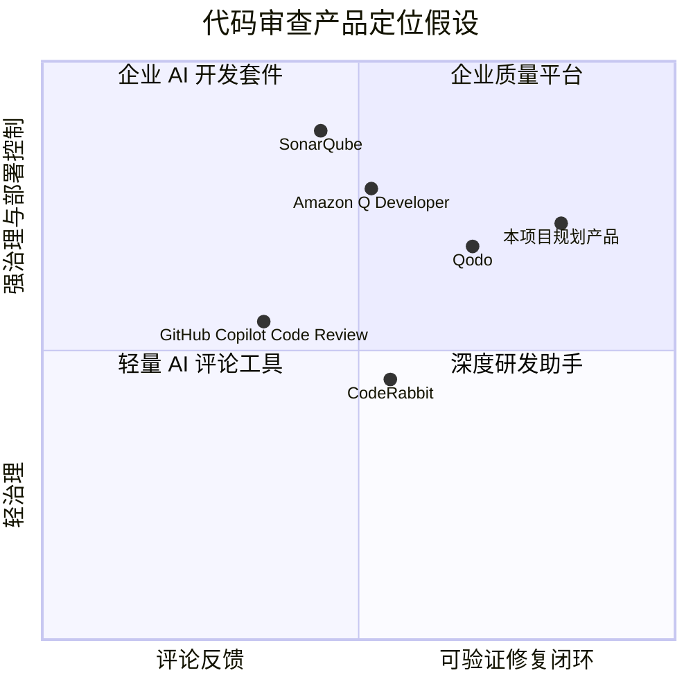
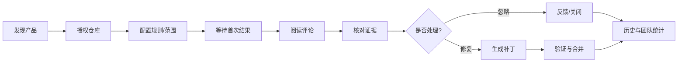

# AI 代码审查竞品分析

## 1. 分析范围与方法

分析对象选择“开发工作流中直接提供 AI 代码审查或代码质量反馈”的产品，不把所有代码助手混在一起比较。评价维度包括：接入位置、发现质量、证据可解释性、自动修复、安全与部署、团队治理、成本可控性。

以下内容是产品形态分析与待实测项，不是对竞品当前版本的完整事实声明。正式面试展示时，建议补充试用日期、具体套餐和截图。

## 2. 竞品矩阵

| 产品/方案 | 主要入口 | 强项 | 可能短板/机会 | 对本项目的启示 |
|---|---|---|---|---|
| GitHub Copilot Code Review | GitHub PR | 原生生态、用户覆盖广、上手成本低 | 结果控制面和深度定制受平台约束 | 首要比较对象；必须证明证据与策略可控 |
| CodeRabbit | PR/MR、IDE | 面向 PR 的工作流完整，评论和总结体验成熟 | SaaS 数据边界、定制深度和成本需核验 | 学习评论分组、增量审查、反馈入口 |
| Qodo | PR、测试与质量流程 | 测试生成、代码质量和团队规则结合 | 产品面较宽，初次配置可能复杂 | 学习质量门禁与团队规则产品化 |
| Amazon Q Developer | IDE、代码仓库、云生态 | 云服务集成、企业采购路径清晰 | 非 AWS 团队的生态依赖、审查聚焦度需核验 | 学习企业权限、审计、模型治理 |
| SonarQube/SonarCloud | CI、IDE、质量门禁 | 规则稳定、可解释、企业治理成熟 | 对新型语义问题和复杂上下文覆盖有限 | AI 不应替代确定性规则，应形成互补 |
| Snyk Code | CI、IDE、安全平台 | 安全检测和漏洞治理强 | 更偏安全场景，通用代码审查体验需核验 | 可从高风险安全问题切入垂直场景 |
| 本项目规划产品 | PR、CLI、API、自托管 | 多 Agent 验证、可控修复、评测与遥测、可私有化 | 生态接入、交互成熟度、规模化运维不足 | 先做可信闭环，再扩展生态与规模 |

## 3. 用户旅程对比

| 阶段 | 成熟 SaaS 常见体验 | 本项目当前基础 | 产品化补强 |
|---|---|---|---|
| 接入 | 安装 App、授权仓库、自动监听 PR | 本地路径 + CLI/API/Streamlit | GitHub/GitLab OAuth、Webhook、权限说明 |
| 首次结果 | 评论直接出现在 diff | 可生成带 finding/verdict 的报告 | 增量上下文、进度状态、失败可重试 |
| 判断 | 评论、严重度、代码位置 | Executor 验证 + Reviewer 汇总 | 证据卡、置信度、规则解释、反馈按钮 |
| 修复 | 建议代码或生成 commit | Fixer + Verify 已有技术基础 | diff 预览、审批、回滚、测试结果 |
| 持续使用 | 规则、历史、团队统计 | 遥测和评测数据已有基础 | 仓库策略、趋势看板、模型/成本预算 |

## 4. SWOT

### Strengths

- 从执行循环、工具、编排到评测均可解释，适合自托管和二次开发。
- 多 Agent 分工天然适合把“提出问题”和“确认问题”解耦。
- 已有权限、限流、缓存、遥测与故障注入，可支撑可信度叙事。

### Weaknesses

- 当前入口仍以本地路径和 Streamlit 为主，尚未形成 PR 原生体验。
- 工程能力多，用户研究和商业指标尚需真实客户验证。
- 质量指标仍受模型、仓库类型和任务范围影响，不能用单一总分概括。

### Opportunities

- 对代码敏感、希望私有化的中小团队存在“可控 AI 审查”需求。
- 现有工具常以评论为终点，带证据的修复验证闭环有机会形成差异化。
- 评测、成本、审计面板可以成为平台能力，而非仅是内部研发工具。

### Threats

- 大平台可以将代码审查作为开发者套件的默认能力。
- 一次高影响误报或错误修复会快速损害信任。
- 模型价格、上下文窗口和供应商政策变化会影响毛利与可用性。

## 5. 差异化策略

不与大平台竞争“评论数量”或“模型参数”，而聚焦三条可验证的产品承诺：

1. **每条高风险发现都能回到证据**：代码位置、上下文、验证动作和理由完整呈现。
2. **每次写入都可控且可回滚**：只读默认、审批后生成补丁、Verify 通过后才能应用。
3. **质量与成本透明**：按仓库、模型、Agent 节点展示准确性、时延、Token 和失败原因。

## 6. 竞品实测清单

正式验证时，使用同一个脱敏仓库和同一组 20 个已标注问题，记录：

- 首次结果时延、评论数量、有效问题数、误报数和漏报数；
- 是否展示代码证据、规则依据、测试结果和置信度；
- 是否支持忽略、反馈、增量审查和团队策略；
- 自动修复是否展示完整 diff、是否运行验证、失败后如何回退；
- 数据存储区域、模型供应商、保留周期、SSO、审计和价格口径。

竞品分析的结论应来自这张实测表，而不是“功能清单越长越强”的判断。

## 7. 竞品定位图

横轴代表“从评论建议到可验证修复闭环”的深度，纵轴代表“团队治理与部署控制能力”。位置是分析假设，正式版本应以实测数据修正。



## 8. 竞品评测口径

### 8.1 样本设计

使用同一个脱敏仓库、同一个 commit、同一组 20 个已标注问题，覆盖安全、Bug、性能、边界处理和假问题。每个产品至少跑 2 次：一次默认配置，一次按公开文档完成最小配置。记录产品版本、模型/套餐、运行时间和权限范围。

### 8.2 评分卡

每项 1～5 分，并保留原始证据；没有观察到的能力记为 `N/A`，不能按印象给分。

| 维度 | 权重 | 评分问题 |
|---|---:|---|
| 结果质量 | 25% | 已标注问题的 Precision/Recall 如何？高危问题是否单独处理？ |
| 证据可解释性 | 20% | 是否给出文件、行号、上下文、规则或验证依据？ |
| 工作流整合 | 15% | PR 增量、更新去重、评论状态和失败重试是否顺畅？ |
| 修复闭环 | 15% | 是否生成完整 diff、运行验证、支持审批与回滚？ |
| 治理与安全 | 15% | 权限、数据保留、SSO、审计、私有化和最小权限如何？ |
| 成本与效率 | 10% | 首次时延、重复任务、并发、价格和成本是否可解释？ |

加权总分只用于同一测试条件下比较，不能把不同套餐、模型和数据边界的结果混成一个排名。

## 9. 竞品体验拆解模板



对每个竞品都填写“用户目标、产品动作、阻塞点、可迁移做法、不可复制原因”，避免只罗列功能名称。

## 10. 本项目的竞争策略选择

### 不正面竞争的领域

- 不和 GitHub 生态竞争安装入口和用户规模。
- 不和 SonarQube 竞争多年积累的确定性规则库。
- 不以“模型更大”作为核心卖点。

### 优先建立的壁垒

1. **证据链壁垒**：把 finding、verdict、验证动作和补丁结果串成可回溯记录。
2. **评测资产壁垒**：持续积累按语言、问题类型、仓库风险分层的评测集。
3. **私有化控制壁垒**：对源代码、工具权限、模型路由和日志保留提供清晰边界。
4. **反馈闭环壁垒**：用户的采纳、误报和回滚反馈能回到规则与评测集。

## 11. 竞品分析结论格式

每条结论使用以下格式，避免“我觉得竞品更好”：

```text
观察：在同一脱敏 PR 上，产品 A 将结果直接写入评论，产品 B 提供证据展开和验证状态。
证据：截图/录屏、版本、运行时间、样本编号。
影响：用户判断时间、采纳率或治理风险的变化。
决策：本项目 P0 是否采用；采用时需要做什么约束。
```
