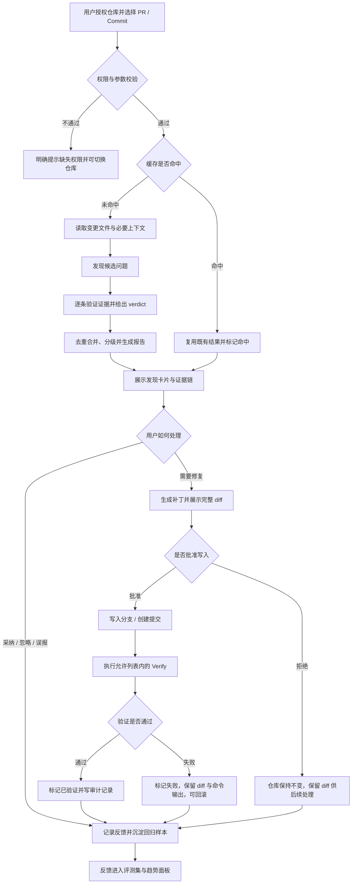
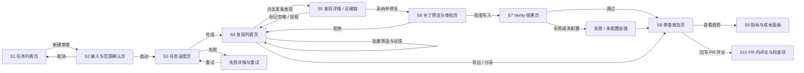
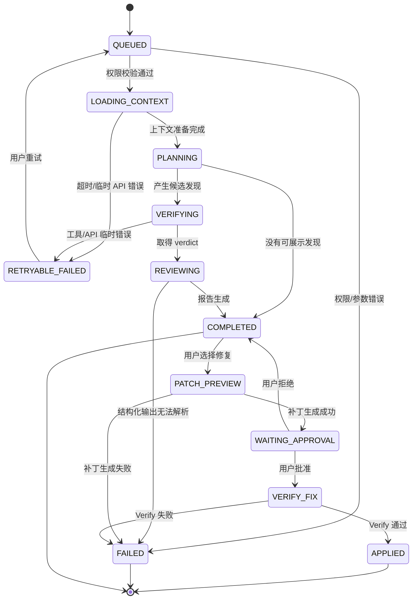
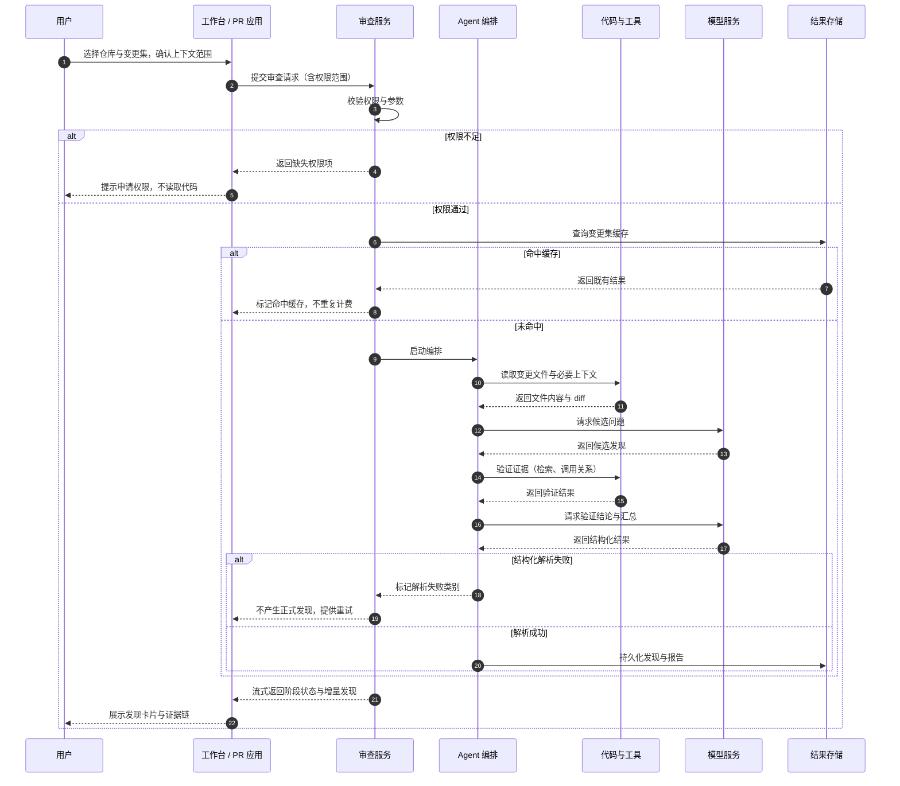
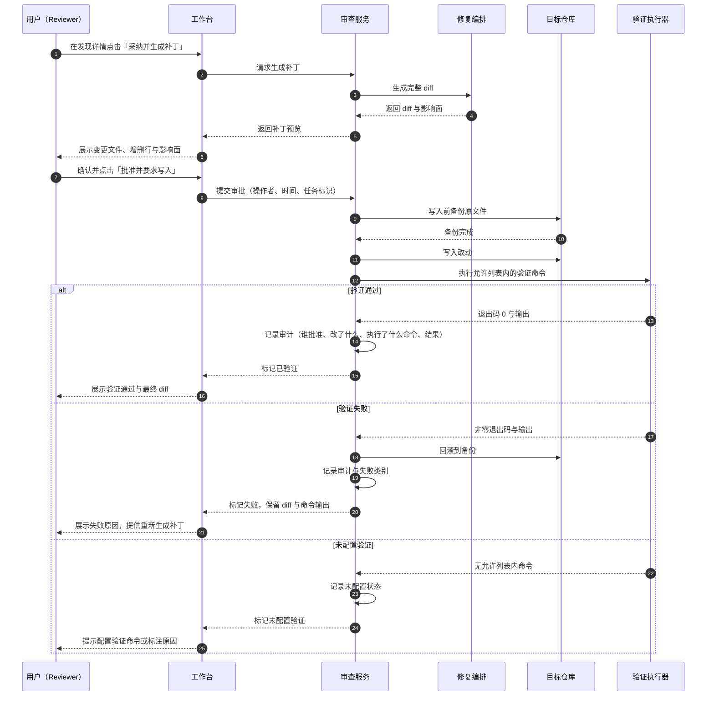
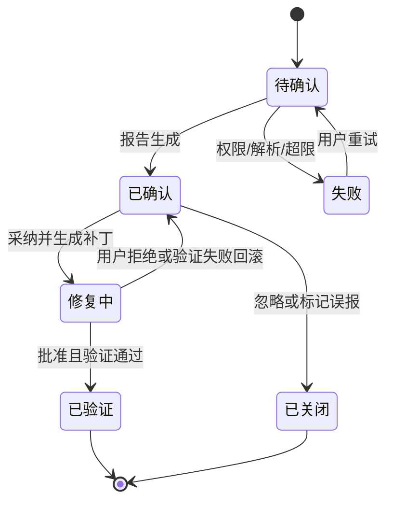
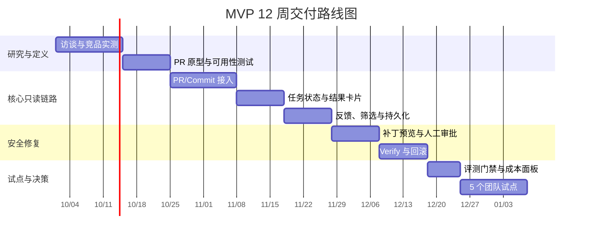

# MVP PRD 与路线图

> 本文是「可信代码审查 Agent」的 MVP 产品需求文档。它把 [01_产品定位与需求分析.md](01_产品定位与需求分析.md) 的需求判断、[05_指标体系与实验方案.md](05_指标体系与实验方案.md) 的度量口径与 [07_商业化与风险评估.md](07_商业化与风险评估.md) 的风险控制收敛成一份可评审、可开发、可验收的规格。
>
> **事实边界（重要）**：本仓库当前是**本地 / 自托管技术原型**。文中「已具备」均有代码证据（见「十五、关联文件与证据」）；「待建设」属于产品化规划，**不代表已经实现**。全文不把规划写成现状。

---

## 📋 项目信息

| 字段 | 值 |
|---|---|
| 项目名称 | 可信代码审查 Agent（Code Review Agent） |
| 文档名称 | MVP PRD 与路线图 |
| 文档版本 | v1.0 |
| 需求状态 | 评审中（P0 范围与「差距关闭表」待研发确认） |
| 目标用户 | 代码作者、Reviewer / Tech Lead、研发经理、安全 / 平台管理员 |
| 涉及端 | GitHub / GitLab Pull Request 应用（待建设）、Web 工作台、CLI、REST API |
| 功能入口 | PR 内评论与检查项；工作台任务页与趋势页；CLI `cra-cli` / `cra-multi`；REST `/analyze` 等接口 |
| 交付阶段 | MVP v0.1（P0）；P1 / P2 / P3 见「十、路线图」 |
| 关联文件 | `docs/architecture.md`、`docs/agent-evaluation-plan.md`、`docs/industrial-gaps.md`、`docs/current-remediation-plan.md`、`reports/`、本目录 00～07 |

---

## 📝 版本记录

| 版本 | 日期 | 修订人 | 修订说明 |
|---|---|---|---|
| v1.0 | 2026-09-28 | 产品负责人 | 由 v0.1 大纲扩写为完整 PRD：新增项目信息、版本记录、需求目标量化表、范围块、逐功能规格与【边界说明】、数据埋点、时序图、非功能需求、发布门槛与灰度、追溯矩阵；P0 功能由 F1～F5 重排为 FR-1～FR-6（新增 FR-6「变更集缓存与额度保护」）；新增「差距关闭表」区分已具备与待建设。影响：研发评估、测试用例与试点验收口径 |
| v0.1 | 2026-09-20 | 产品负责人 | 首版 MVP 范围与 12 周路线图大纲，确立只读优先、审批后修复的产品边界 |

---

## 一、需求背景

**谁在什么场景遇到什么问题。** 使用 GitHub / GitLab PR 流程的研发团队，在合入主干前的审查环节依赖人工 Reviewer：代码作者提交变更后等待人工审查，Reviewer 需要在有限时间内判断变更是否可合入。该环节存在三个结构性问题：审查时间与开发节奏错位（作者被阻塞、Reviewer 被打断）、重复性低风险问题持续消耗高级工程师注意力、评论缺少可复现证据导致作者不信任结论。

**造成什么影响。** 对代码作者，反馈到达晚、来回沟通多，等不到结论就无法推进；对 Reviewer，上下文切换成本高，大量时间花在确认低价值问题上；对研发管理者，审查投入无法量化，无法判断质量投入是否产生收益；对安全 / 平台人员，引入外部 AI 工具会带来代码外发、自动改写失控和结果不可追溯的合规风险。产品机会因此不是「再做一个能生成评论的模型入口」，而是把每个高风险问题转化为**可核验、可处理、可回滚的决策单元**。

**证据是什么。** 本仓库已有的评测产物：标注集 124 条（108 条正例 + 16 条 FP 陷阱），2026-09-27 replay 扫描 124/124，运行口径 Precision 95.3%、Recall 38.0%、F1 0.54，其中 3 条 API 超时被当前脚本计入 FN；排除 API_ERROR 后 Precision 95.3%、Recall 39.0%、F1 0.55。这组数字说明「误报已经可控、漏报明显」，直接决定本 PRD 的两个产品选择：**结果默认不阻塞合并**、**高危问题需要确定性规则兜底**。

> 事实来源：`reports/eval_replay_20260927.md`、`docs/agent-evaluation-plan.md`。
>
> **口径必须并列说明**：仓库内另有一份产物 `data/eval_results.json` 记录 `TP=48 / FP=1 / FN=60 / TN=15`（Precision 98.0%、Recall 44.4%、F1 0.61）。两份产物来自不同运行（不同时间、不同模型 / 判官配置），**不得混用或取优**，引用时必须写清来源与日期。README 中 `deepseek-chat` 那一行指标在仓库内**找不到对应产物文件**，因此不作为本文依据。
>
> **尚未完成**：真实客户访谈、真实 PR 试点、完整自动修复质量评测、长期 ROI 证明。目标用户画像与付费意愿来自行业观察与项目内假设，标注为待验证（见 02、07）。

---

## 二、需求目标

**总目标：让代码作者和 Reviewer 在一个 PR 内完成「发现问题 — 核验证据 — 决定处理 — 安全生成补丁」的闭环，并愿意把结果当作审查输入，而不是把它当作需要再次审查的噪音源。**

判断成功的不是「生成了多少条评论」，而是用户是否愿意据此改变合并决策，以及系统在真实仓库约束下是否稳定、可解释、可控。

| 用户结果 | 衡量指标 | 统计口径 | 预期方向 | 目标值 |
|---|---|---|---|---|
| 作者在合并前就能拿到可用反馈，不再干等人工审查 | 首结果时延 P95 | 任务开始至第一条可判断结果的耗时 95 分位数 | ↓ | ≤ 5 分钟 |
| Reviewer 打开产品就能看到可信结论，不必自己再核一遍 | 有帮助率 | 标记「有帮助」的发现数 ÷ 有明确反馈的发现数 | ↑ | ≥ 60% |
| 结果被真正用起来，而不只是被看过 | 采纳率 | 已采纳或已修复的确认问题数 ÷ 确认问题数 | ↑ | 待基线确认 |
| 用户不被错误结论误导 | 误报率 | 被标记为误报的发现数 ÷ 有反馈的发现数 | ↓ | ≤ 20% |
| 高危问题不漏，安全事故不发生 | 高危问题召回率 | 被检出的高危标注问题数 ÷ 标注集中高危问题数 | ↑ | 待基线确认（不低于普通问题召回率） |
| 重复审查不再重复付费与等待 | 缓存命中率 | 命中缓存的审查任务数 ÷ 审查任务总数 | ↑ | 待基线确认 |
| 修复动作不制造新故障 | Verify 通过率 | 通过验证的应用补丁数 ÷ 已执行验证的补丁数 | ↑ | ≥ 90% |
| 修复动作可放心授权 | 回归引入率 | 修复后新增失败的补丁数 ÷ 已应用且完成回归检查的补丁数 | ↓ | 趋近 0 |
| 单位成本可承受、可解释 | 成本/PR | 模型与基础设施成本 ÷ 完成审查的 PR 数 | ↓ | 待成本测算 |

> 口径细则、切片维度与分母定义以 [05_指标体系与实验方案.md](05_指标体系与实验方案.md) §3.1 为准。**没有真实基线前一律写「待基线确认」，不编造增幅。**
>
> 上文 Precision 95.3% / Recall 38.0% 是**单次、单数据集**的离线评测观察值，不能当作真实用户价值或跨仓库泛化能力的证明。

---

## 三、需求概述

### 3.1 范围块

| 本期范围（MVP v0.1 交付） | 说明 |
|---|---|
| 变更集为中心的只读审查 | 以 PR / Commit 为输入，只读取变更文件与必要上下文，不做全仓库默认扫描 |
| 可核验的发现卡片 | 每条发现可回到文件、行号、上下文与验证动作；三类 verdict 视觉可区分 |
| 任务状态与失败可恢复 | 阶段可见，失败可归因、可重试，刷新后可恢复 |
| 补丁预览 + 人工审批 | 针对已确认问题生成完整 diff，**未经审批不写入**；写入可回滚 |
| 有边界的 Verify | 只能执行允许列表内的校验命令，结果如实回传 |
| 变更集缓存与额度保护 | 同一 commit 重复审查复用缓存，不重复消耗模型额度 |
| 反馈沉淀 | 采纳 / 忽略 / 误报标签与理由进入反馈事件与回归样本 |

| 本期不做什么 / 暂不展开 | 为什么这次不做 |
|---|---|
| 不替代人工安全审计、架构评审与发布审批 | 产品定位是审查输入，不是质量责任的转移；模型能力边界未验证 |
| 不做 IDE 内联实时补全与全仓库聊天 | 偏离「合并前决策」这一高频高价值场景，输入边界也不可控 |
| 不做自动合并、不做强制阻塞合并 | 当前 Recall 明显偏低，漏报风险下强阻塞会直接伤害研发流程；先建立误报与漏报基线 |
| 不做复杂 RBAC 与组织级策略编排 | 依赖企业身份体系与审计能力，属 P2；MVP 只做固定权限矩阵 |
| 不把用户反馈直接当标注真值 | 反馈含噪音，直接当标签会污染评测集；MVP 只沉淀为待复核样本 |
| 不默认保存完整源代码与密钥 | 数据最小化是安全前提；只存任务输入、结构化发现与脱敏后的证据摘要 |

### 3.2 功能清单

| 序号 | 模块 | 一级功能 | 说明 | 对应原编号 |
|---:|---|---|---|---|
| 1 | 变更集接入 | FR-1 PR / Commit 接入与上下文边界 | 授权仓库后选择 PR / Commit，只读取变更文件与必要上下文；读取范围在任务开始前可见 | F1 |
| 2 | 任务生命周期 | FR-2 审查任务状态与失败恢复 | 展示排队、读取上下文、分析、验证、生成报告、失败、完成；失败可归因可重试 | F2 |
| 3 | 审查结果 | FR-3 发现卡片与证据链 | 类别、严重度、位置、描述、证据、影响、建议、验证状态、处理状态；可跳转、可筛选、可反馈 | F3 |
| 4 | 安全修复 | FR-4 补丁预览与人工审批 | 生成完整 diff，展示影响面；审批后写入，全程审计与可回滚 | F4 |
| 5 | 安全修复 | FR-5 Verify 结果与降级 | 执行语法检查与允许列表内的校验命令，如实回传通过 / 失败 / 未配置 | F5 |
| 6 | 效率与成本 | FR-6 变更集缓存与额度保护 | 同 commit 复用结果；重试与并发不失控，成本可见 | 新增 |

### 3.3 跨功能共享规则

以下规则被多个功能与界面共用，**只在本节写全**，「六、详细方案」各功能格只引用、不重复展开。

#### 3.3.1 权限矩阵

| 动作 | 代码作者 | Reviewer | 平台管理员 | 默认策略 |
|---|---:|---:|---:|---|
| 查看审查结果 | ✓ | ✓ | ✓ | 仅授权仓库成员 |
| 标记采纳 / 忽略 / 误报 | ✓ | ✓ | ✓ | 写入反馈事件，保留操作者与时间 |
| 生成补丁 | ✓ | ✓ | ✓ | 只生成，不写入 |
| 批准写入 | − | ✓ | ✓ | 明确确认 + 审计记录 |
| 修改仓库规则 | − | − | ✓ | 组织级权限 |
| 查看成本与遥测 | 部分 | 部分 | ✓ | 脱敏后按角色展示 |
| 查看审计记录 | − | 部分 | ✓ | 只读，不可删改 |

#### 3.3.2 严重度与优先级口径

| 严重度 | 判定依据 | 默认展示顺序 | 是否允许阻塞合并（MVP） |
|---|---|---|---|
| High | 可导致安全漏洞、数据错误、崩溃或资金 / 权限损失 | 1（最前） | 否（只软提醒，人工判断） |
| Medium | 可导致逻辑错误、性能退化或可维护性显著下降 | 2 | 否 |
| Low | 风格、命名、注释、轻微可读性问题 | 3 | 否 |

#### 3.3.3 verdict 与处理状态口径

| verdict | 含义 | 用户可见表现 | 处理状态取值 |
|---|---|---|---|
| `CONFIRMED` | 已取得证据支持，问题成立 | 强提示，默认进入修复候选 | `OPEN / ACCEPTED / FIXED / FAILED` |
| `FALSE_POSITIVE` | 已验证为误报 | 弱化展示，仍可追溯原因 | `IGNORED` |
| `UNCERTAIN` | 证据不足，无法确认 | 明确标注「不确定」，不进入默认修复候选 | `OPEN / IGNORED` |

#### 3.3.4 风险分级与授权口径

| 等级 | 覆盖动作 | 授权要求 |
|---|---|---|
| SAFE（只读） | 读取文件、列目录、检索、取 diff、克隆授权仓库 | 默认自动放行 |
| MODERATE（受控写入 / 受控执行） | 写入文件、执行允许列表内命令、创建分支或提交 | 需明确审批；写前自动备份 |
| DANGEROUS（危险动作） | 递归删除、磁盘格式化、关机、系统级设备写入等 | MVP 一律拒绝，不提供自助放行入口 |

> **当前实现与本节要求的差距（必须在 MVP 关闭，见 3.4 G-4）**：现有人工审批守卫在未注入外部审批回调时，会把「受控写入 / 受控执行」级动作**自动放行**；并且有的入口根本不注入该守卫，因此**当前不存在「任何写入均需人工审批」的保证**。本节描述的是 MVP 的目标行为，不是现状。

#### 3.3.5 缓存与额度口径

| 规则 | 口径 |
|---|---|
| 缓存键 | 仓库标识 + commit SHA + 上下文策略版本 + 模型 / 提示词版本 |
| 命中缓存 | 直接复用既有结果，任务标记为「命中缓存」，**不重复计费** |
| 未命中但要复用 | 必须明确告知用户「为何重新计算」（如上下文策略或模型版本已变更） |
| 单任务额度保护 | 单任务 Token 与工具轮次有上限，触顶后转为「部分完成 + 明确说明」而不是静默截断 |
| 重试 | 有限次退避重试，重试不叠加重复计费；超过上限进入失败态 |

> **当前实现与本节要求的差距**：现有缓存是**进程内的模型响应缓存**（内存 + 过期时间，进程重启即失效），**没有变更集粒度的审查结果缓存**；也没有任何 Token / 成本上限与数据保留策略。缓存键的前三项属 MVP 待建设（见 3.4 G-6）。

### 3.4 差距关闭表（已具备 → MVP 需建设）

本表是研发评估的工作量依据，也是评审时最容易产生误解的地方，因此逐项列出。

| 编号 | 能力 | 已具备的现状（代码证据） | MVP 需建设 |
|---|---|---|---|
| G-1 | PR / Commit 原生接入 | 仅本地路径 / 本地 git 仓库操作（`get_diff`、`fetch_pr`、`clone_repo`） | GitHub / GitLab 授权、变更集列表、行内评论回写 |
| G-2 | 任务状态机 | **无任务状态枚举**；会话 `mode` 是自由字符串 | QUEUED～APPLIED 状态持久化、阶段可见、刷新恢复 |
| G-3 | 发现字段规格 | `Finding` 现有 `line`（单值）、`verdict`（含 `PENDING`）、`verified` | `line_start/line_end`、`status`、`evidence` 结构化、`verify_status`、`trace_id` |
| G-4 | 写入人工审批 | 风险分级已实现；**默认自动放行中度风险动作，且部分入口未注入守卫** | 所有入口强制注入审批；未获批准不得写入；审计留痕 |
| G-5 | 命令允许列表 | 沙箱支持白名单参数，但**默认空 = 不过滤**；容器级沙箱已实现但**从未被实例化** | 默认允许列表 + 超时；按需启用容器级隔离 |
| G-6 | 变更集缓存 | 仅进程内模型响应缓存（内存 + 过期时间） | 按缓存键的持久缓存与命中说明 |
| G-7 | 额度与预算控制 | **无 Token / 成本上限、无预算阈值、无保留策略** | 单任务上限、超限转「部分完成」、成本可查 |
| G-8 | 追踪标识 | **无 trace_id / span_id**；日志会话标识与数据库会话标识不互通 | 统一可关联的追踪标识 |
| G-9 | 审计不可篡改 | 追加写日志文件 + 日志表，**无防篡改、无保留期** | 审计记录只读、可追溯、按策略保留 |
| G-10 | 用户隔离 | 依赖会话所有人标识过滤；**有已知入口未做该隔离** | 全部入口统一隔离校验 |

---

## 四、业务流程图



---

## 五、交互流程图



---

## 六、详细方案

> **原型列降级声明**：本产品 MVP 的交付面是「PR 应用 + Web 工作台 + CLI / API」，当前尚无界面设计稿与截图素材。因此「原型」列按**文字线框（页面元素清单）**呈现，每行标注素材状态；素材补齐后替换为截图或可交互原型。详细方案的行粒度 = **一个界面或一个状态变体**。

### 6.1 界面清单

| 界面编号 | 界面名称 | 所属模块 | 原型素材状态 |
|---|---|---|---|
| S1 | 任务列表页 | 工作台 | 待补截图 |
| S2 | 接入与范围确认页 | 工作台 | 待补截图 |
| S3 | 任务进度页 | 工作台 | 待补截图 |
| S4 | 发现列表页 | 工作台 | 待补截图 |
| S5 | 发现详情 / 证据链页 | 工作台 | 待补截图 |
| S6 | 补丁预览与审批页 | 工作台 | 待补截图 |
| S7 | Verify 结果页（通过 / 失败 / 未配置） | 工作台 | 待补截图 |
| S8 | 审查报告页 | 工作台 | 待补截图 |
| S9 | 指标与成本面板 | 工作台 | 待补截图 |
| S10 | PR 内评论与检查项 | PR 应用 | 待补截图 |

### 6.2 FR-1 变更集接入与上下文边界

**功能目标**：让用户在授权范围内、以最小读取量启动一次审查，并在开始前就知道系统会读什么。
**覆盖界面**：S2、S10。

---

#### 6.2.1 S2 接入与范围确认页

**文字线框**

```text
┌──────────────────────────────────────────────────────────────┐
│ 新建审查                                                      │
├──────────────────────────────────────────────────────────────┤
│ 1. 仓库                                                       │
│    [ 已授权仓库下拉 ▾ ]   · 未授权时显示「申请权限」入口       │
│ 2. 变更集                                                     │
│    ( ) Pull Request  [ PR 编号 / 列表 ▾ ]                     │
│    ( ) Commit        [ commit SHA 输入框 ]                    │
│    · 展示：标题、作者、目标分支、变更文件数、增删行数           │
│ 3. 上下文范围（只读，默认值可被管理员策略覆盖）                 │
│    读取：变更文件全文、变更文件所在目录、被引用符号所在文件      │
│    不读取：其余仓库文件与历史提交全文                          │
│    [ 展开查看将读取的文件清单（N 个）]                          │
│ 4. 权限与影响提示                                              │
│    · 本次为只读审查，不会修改任何文件                          │
│    · 预计消耗与预计耗时区间                                    │
│ 5. 操作                                                       │
│    [ 启动审查 ]   [ 取消 ]                                    │
└──────────────────────────────────────────────────────────────┘
```

**【页面元素】**

1. 顶部标题栏：标题「新建审查」+ 返回任务列表入口。
2. 仓库选择区：已授权仓库下拉；未授权仓库不可选，并提供「申请权限」入口。
3. 变更集选择区：单选「Pull Request / Commit」；前者为 PR 编号或列表，后者为 commit SHA 输入框。
4. 变更集摘要卡片：PR 标题、作者、目标分支、变更文件数、增删行数。
5. 上下文范围区块：以「读取 / 不读取」两行说明边界，并提供「展开查看将读取的文件清单」。
6. 权限与影响提示区：只读声明、预计消耗、预计耗时区间。
7. 底部操作区：「启动审查」主按钮、「取消」次按钮。

**【交互说明】**

1. 选择仓库 → 加载该仓库可选 PR / Commit 列表；无权限仓库不进入下一步。
2. 切换「Pull Request / Commit」→ 变更集输入控件随之切换，两种模式各自保留已填内容。
3. 点击「展开查看将读取的文件清单」→ 展开文件路径列表；清单过长时分页展示。
4. 点击「启动审查」→ 校验权限与参数；通过则跳转 S3，不通过则在当前页就地提示原因与修复入口。
5. 点击「取消」→ 放弃本次配置并返回 S1，不产生任何读取与计费。

**【功能逻辑】**

1. 上下文读取范围在任务开始前确定并展示，任务启动后不再静默扩大；确需扩大时必须回到本页重新确认。

**【边界说明】**

1. 仓库未授权 → 「启动审查」置灰，点击提示所需权限项与「申请权限」入口，不读取任何代码。
2. 变更集不存在或已被强制推送覆盖 → 提示「该变更集已不可用」，并提供重新选择入口。
3. 无变更文件（空 diff）→ 允许启动但明确提示「未检测到变更」，任务完成后不产生发现。
4. 变更文件数或 diff 体量超出上下文上限 → 提示缩小范围或改为「仅审查指定目录」，不静默截断文件。
5. 同一 commit 命中缓存 → 启动前即提示「该 commit 已审查过，将复用结果」，用户可选择复用或强制重新计算。

---

#### 6.2.2 S10 PR 内评论与检查项

**文字线框**

```text
┌─ GitHub / GitLab PR 页面 ─────────────────────────────────────┐
│ ✅ 可信代码审查 · 已完成      发现 7 条（High 1 / Medium 4 / Low 2）│
│    查看完整报告 →   · 本次为只读审查，未修改任何文件            │
├──────────────────────────────────────────────────────────────┤
│ 💬 评论（挂在具体代码行）                                       │
│    [High] 未校验的用户输入直接拼接进 SQL 查询                   │
│    证据：第 42-47 行 + 调用方第 12 行 · 验证：已确认            │
│    建议：改用参数化查询                                        │
│    [ 打开证据链 ]  [ 采纳 ]  [ 忽略 ]  [ 标记误报 ]             │
└──────────────────────────────────────────────────────────────┘
```

**【页面元素】**

1. 检查项摘要行：审查状态、发现总数与严重度分布、「查看完整报告」入口、只读声明。
2. 行内评论：严重度标签、问题描述、证据摘要（位置 + 验证结论）、建议、三个反馈按钮与「打开证据链」入口。

**【交互说明】**

1. 点击「查看完整报告」→ 在浏览器打开 S8 审查报告页。
2. 点击「打开证据链」→ 打开 S5 并定位到该条发现。
3. 点击「采纳 / 忽略 / 标记误报」→ 写入反馈事件并在评论上回显当前处理状态。

**【功能逻辑】**

1. 评论默认不阻塞合并；MVP 不产生任何「必须解决」级别的检查结论。

**【边界说明】**

1. 审查任务未完成 → 检查项显示进行中状态，不产生部分评论。
2. 任务失败 → 检查项显示失败与可操作原因，不产生评论。
3. 同一行有多条发现 → 合并为一条评论，内部按严重度排序，避免刷屏。
4. PR 更新产生新 commit → 旧评论标记为「基于历史 commit」，新结果另行展示，不静默覆盖。

---

### 6.3 FR-2 审查任务状态与失败恢复

**功能目标**：让用户随时知道任务到了哪一步、下一步是什么、失败后怎么自救。
**覆盖界面**：S1、S3。

---

#### 6.3.1 S1 任务列表页

**文字线框**

```text
┌──────────────────────────────────────────────────────────────┐
│ 审查任务                              [ 新建审查 ]            │
├──────────────────────────────────────────────────────────────┤
│ 筛选：仓库 ▾ | 状态 ▾ | 时间范围 ▾ | 仅看失败 ☐               │
├──────────────────────────────────────────────────────────────┤
│ 任务  仓库/变更集      状态        发现  首结果  操作          │
│ ──────────────────────────────────────────────────────────── │
│ #1042 api-server PR#88 已完成      7    1m52s   查看报告      │
│ #1041 web-app  PR#87   等待审批    3    —       查看补丁      │
│ #1039 pay-svc  PR#85   失败(权限)  —    —       重试 / 详情   │
└──────────────────────────────────────────────────────────────┘
```

**【页面元素】**

1. 顶部标题栏与「新建审查」主按钮。
2. 筛选栏：仓库、状态、时间范围、仅看失败。
3. 任务表格：任务编号、仓库与变更集、状态、发现数、首结果时延、操作入口。

**【交互说明】**

1. 点击某行任务 → 按任务所处阶段进入 S3 进度页、S4 发现列表页或 S8 报告页。
2. 点击「重试」→ 复用原任务输入重新排队，生成新任务编号并保留与原任务的关联。
3. 切换筛选条件 → 列表即时刷新，筛选状态写入地址栏以便分享与刷新恢复。

**【数据与内容规则】**

1. 仅展示当前用户有权访问的仓库任务。
2. 默认按创建时间倒序；支持按状态与严重度筛选。

**【边界说明】**

1. 无任何任务 → 空态引导「新建一次只读审查」，并给出一条示例任务说明。
2. 任务列表加载失败 → 展示重试入口，不显示假数据。
3. 任务量超出单页 → 分页或游标加载，不通过截断隐藏旧任务。

---

#### 6.3.2 S3 任务进度页

**文字线框**

```text
┌──────────────────────────────────────────────────────────────┐
│ 任务 #1042 · api-server · PR#88                    [ 取消 ]   │
├──────────────────────────────────────────────────────────────┤
│ ① 权限校验   ✅  已完成                                        │
│ ② 读取上下文 ✅  已完成 · 12 个文件 / 340 行                   │
│ ③ 分析变更   ⏳  进行中 · 已发现 5 条候选                      │
│ ④ 验证证据   ○   等待中                                        │
│ ⑤ 生成报告   ○   等待中                                        │
├──────────────────────────────────────────────────────────────┤
│ 预计还需 约 1 分钟 · 已用 32 秒 · 当前消耗 18.4k tokens        │
│ [ 查看已确认的发现（出现即可查看）]                            │
└──────────────────────────────────────────────────────────────┘
```

**【页面元素】**

1. 任务头部：任务编号、仓库、变更集、取消入口。
2. 阶段清单：权限校验、读取上下文、分析变更、验证证据、生成报告，各自状态图标与补充信息。
3. 进度信息行：预计剩余、已用时间、当前消耗。
4. 增量结果入口：「查看已确认的发现」，出现第一条结果后即可点击。

**【交互说明】**

1. 任务进行中刷新页面 → 恢复当前阶段与已产出结果，不重头开始。
2. 点击「取消」→ 停止后续阶段并保留已产生结果，任务标记为已取消。
3. 出现第一条可判断结果 → 展开增量入口并提示首结果时延。
4. 阶段失败 → 就地展开失败原因与「重试」入口，不隐藏原始错误类别。

**【功能逻辑】**

1. 只展示用户可理解的阶段名，不展示内部 Agent 日志与调试细节。
2. 「读取上下文」完成后展示实际读取的文件数与行数，与 S2 的承诺范围一致。

**【边界说明】**

1. 权限校验失败 → 阶段①标红，提示缺失权限项与「申请权限」入口，不进入后续阶段。
2. 上下文读取超时 → 标记为可重试失败，保留已读取部分，重试时优先复用已完成工作。
3. 结构化结果无法解析 → 不产生正式发现，标记失败类别为「结果解析失败」并允许重试。
4. 模型限流或服务错误（429 / 5xx）→ 有限次退避重试，显示等待与重试次数，不重复计费失控。
5. 单任务消耗触顶 → 转为「部分完成」，明确说明已覆盖与未覆盖范围，不静默截断。
6. 页面长时间未刷新后回到本页 → 从服务端恢复最新状态，不依赖前端本地计时。

---

### 6.4 FR-3 发现卡片与证据链

**功能目标**：让用户在不读完整代码的情况下判断一条发现是否可信、是否要处理。
**覆盖界面**：S4、S5。

---

#### 6.4.1 S4 发现列表页

**文字线框**

```text
┌──────────────────────────────────────────────────────────────┐
│ 任务 #1042 · api-server · PR#88 · 已完成                      │
│ 发现 7 条：High 1 · Medium 4 · Low 2  |  已确认 5 · 误报 1 · 不确定 1 │
├──────────────────────────────────────────────────────────────┤
│ 排序：风险 ▾ | 筛选：verdict ☐ 严重度 ☐ 类别 ☐ 文件 ▾ | 🔍   │
├──────────────────────────────────────────────────────────────┤
│ [High] 🔴 已确认   未校验输入拼接进 SQL 查询                    │
│   auth/login.py:42-47 · 证据 3 项 · 采纳 忽略 误报  详情 →     │
│ [Medium] 🟡 不确定  循环内重复查询导致 N+1                     │
│   order/service.py:118 · 证据 1 项 · 采纳 忽略 误报  详情 →    │
│ [Low] ⚪ 已确认为误报  变量命名不符合项目规范                   │
│   utils/fmt.py:9 · 证据 2 项 · 撤销标记         详情 →        │
└──────────────────────────────────────────────────────────────┘
```

**【页面元素】**

1. 任务摘要栏：仓库、变更集、状态、发现总数与严重度分布、verdict 分布。
2. 排序与筛选栏：排序维度、verdict / 严重度 / 类别 / 文件筛选、关键词搜索。
3. 发现卡片列表：严重度标签、verdict 标签、标题、文件与行号、证据条数、行内反馈按钮、「详情」入口。

**【交互说明】**

1. 点击卡片或「详情」→ 进入 S5 并定位该条发现。
2. 点击卡片上的文件与行号 → 在代码 diff 视图中定位到对应行并高亮。
3. 点击「采纳 / 忽略 / 误报」→ 就地更新处理状态并写入反馈事件；已标记项可撤销。
4. 批量选择后执行同一操作 → 统一写入反馈事件，逐条保留操作者与时间。

**【功能逻辑】**

1. 默认按风险排序（严重度优先，其次 verdict 置信度，其次影响面）。
2. `CONFIRMED / FALSE_POSITIVE / UNCERTAIN` 在颜色、图标与文案三者上都可区分，不能只靠颜色。
3. 每条展示的发现必须带文件与行号；行号越界时降级为文件级并明确标注。

**【边界说明】**

1. 无发现 → 空态明确说明「本次未发现可展示问题」，并说明覆盖与未覆盖范围，不使用「代码很干净」这类过度承诺。
2. 筛选结果为空 → 提示当前筛选条件与「清除筛选」入口，不显示空列表。
3. 行号越界或文件已变更 → 降级为文件级定位并提示「行号基于历史版本」。
4. 同一位置多条发现 → 合并为一张卡片，内部分条列出，避免重复刷屏。
5. 大变更集（数百条发现）→ 分页并默认只展开 High / Medium；Low 折叠。

---

#### 6.4.2 S5 发现详情 / 证据链页

**文字线框**

```text
┌──────────────────────────────────────────────────────────────┐
│ ← 返回发现列表        [High] 🔴 已确认           [ 采纳并修复 ]│
├──────────────────────────────────────────────────────────────┤
│ 问题描述                                                      │
│   auth/login.py:42-47 用户输入未校验即拼接进 SQL 查询           │
│ 影响                                                          │
│   攻击者可构造输入读取任意表数据；严重度由规则校准后定为 High    │
│ 证据链                                                        │
│   1. 代码片段：login.py:42-47（最小上下文 6 行）               │
│   2. 调用关系：views/auth.py:12 传入 request.args['user']      │
│   3. 验证动作：检索同仓库既有防护写法 / 确认无参数化            │
│   4. 验证结论：CONFIRMED（证据 3 项）                          │
│ 建议                                                          │
│   改用参数化查询；最小可行修复，不改变函数签名                  │
│ 处理                                                          │
│   [ 采纳并生成补丁 ]  [ 忽略（需填原因）]  [ 标记误报（需填原因）]│
└──────────────────────────────────────────────────────────────┘
```

**【页面元素】**

1. 顶部导航与操作区：返回入口、严重度与 verdict 标签、「采纳并修复」主按钮。
2. 问题描述区：现象与位置。
3. 影响区：后果与严重度判定依据。
4. 证据链区：逐项列出代码片段、调用关系、验证动作、验证结论与证据条数。
5. 建议区：最小可行修复方向。
6. 处理区：采纳 / 忽略 / 误报三个动作，忽略与误报需填写原因。

**【交互说明】**

1. 点击证据项中的代码位置 → 展开对应代码片段或跳转 diff 对应行。
2. 点击「采纳并生成补丁」→ 进入 S6，并携带该发现标识。
3. 选择「忽略 / 标记误报」→ 弹出原因输入（常用原因选项 + 自定义），提交后返回 S4 并更新状态。
4. 对 `UNCERTAIN` 的发现点击采纳 → 提示证据不足，需人工确认后再生成补丁。

**【功能逻辑】**

1. 证据链每一项都必须可追溯到真实读取内容，不允许展示未经证据支持的因果结论。
2. 严重度由模型建议、规则校准后定档；用户可见判定依据。

**【边界说明】**

1. 证据缺失（上下文读取失败）→ 降级为 `UNCERTAIN` 并说明证据不完整，不给出确定结论。
2. 代码在该发现生成后已被修改 → 提示「代码已变更，证据可能过期」，提供基于最新版本重跑入口。
3. 未填原因即提交忽略 / 误报 → 阻止提交并提示原因必填。
4. 同一发现被多人标记为不同状态 → 保留全部反馈事件，以最新一次为当前状态并展示历史。

---

### 6.5 FR-4 补丁预览与人工审批

**功能目标**：让修复动作在写入前完全可见、可拒绝、可回滚。
**覆盖界面**：S6。

---

#### 6.5.1 S6 补丁预览与审批页

**文字线框**

```text
┌──────────────────────────────────────────────────────────────┐
│ 补丁预览 · auth/login.py                       [ 返回发现 ]   │
├──────────────────────────────────────────────────────────────┤
│ 变更文件 1 个 · +4 / −2 行 · 基于 commit a1b2c3d               │
│ 影响面：仅本文件内函数 login() 的查询构造                      │
├──────────────────────────────────────────────────────────────┤
│ -  query = "SELECT * FROM users WHERE name='" + user + "'"    │
│ +  query = "SELECT * FROM users WHERE name = ?"               │
│ +  cursor.execute(query, (user,))                             │
├──────────────────────────────────────────────────────────────┤
│ ☑ 我已确认该改动符合本仓库约定                                 │
│ [ 批准并要求写入 ]   [ 拒绝 ]   [ 复制 diff ]                 │
└──────────────────────────────────────────────────────────────┘
```

**【页面元素】**

1. 顶部信息栏：目标文件、「返回发现」入口。
2. 变更摘要：变更文件数、增删行数、基于的 commit、影响面说明。
3. 完整 diff 视图：逐行展示增删内容，保留上下文行。
4. 确认勾选项：确认改动符合仓库约定。
5. 操作区：「批准并要求写入」主按钮、「拒绝」、「复制 diff」。

**【交互说明】**

1. 点击「批准并要求写入」→ 勾选项已确认时提交审批，进入写入与 Verify 流程；未勾选则提示先确认。
2. 点击「拒绝」→ 不写入任何文件，保留该 diff 供后续处理，返回 S4 并记录拒绝反馈。
3. 点击「复制 diff」→ 复制完整 diff 到剪贴板，便于在 PR 中讨论或手动应用。
4. 批准后 → 跳转 S7 并展示实时验证状态。

**【功能逻辑】**

1. 写入前必须展示变更文件、增删行数与影响面。
2. 任何写入都必须记录操作者、时间、任务标识与回滚信息。
3. 写前自动保留可回滚的原文件副本。

**【边界说明】**

1. 补丁生成失败 → 明确提示失败原因，不写入任何文件，发现状态保持为可重试的待处理。
2. 目标文件在生成补丁后被他人修改 → 阻止直接写入，提示冲突并提供重新生成补丁入口。
3. 用户拒绝 → 仓库原文件保持不变，拒绝行为进入反馈事件。
4. 审批过程中关闭页面 → 不产生写入；重新进入时恢复待审批状态。
5. 目标分支受保护或用户无写入权限 → 在审批前即提示，只保留「复制 diff」路径。
6. 单次补丁影响文件数超出上限 → 阻止批量写入，要求拆分为多次审批。

---

### 6.6 FR-5 Verify 结果与降级

**功能目标**：如实告诉用户修复是否成立，绝不把失败伪装成成功。
**覆盖界面**：S7。

---

#### 6.6.1 S7 Verify 结果页（通过 / 失败 / 未配置三态）

**文字线框**

```text
通过态
┌──────────────────────────────────────────────────────────────┐
│ ✅ 验证通过 · 已写入 auth/login.py                             │
│ 执行命令：语法检查（允许列表） · 耗时 3.2s                     │
│ [ 查看最终 diff ]  [ 返回发现列表 ]                            │
└──────────────────────────────────────────────────────────────┘

失败态
┌──────────────────────────────────────────────────────────────┐
│ ❌ 验证失败 · 未应用改动，原文件已回滚                         │
│ 执行命令：pytest tests/test_auth.py（允许列表）· 退出码 1      │
│ 输出摘要：2 failed, 5 passed                                   │
│ [ 查看完整输出 ] [ 重新生成补丁 ] [ 手动处理 ]                 │
└──────────────────────────────────────────────────────────────┘

未配置态
┌──────────────────────────────────────────────────────────────┐
│ ⚠️ 未配置验证 · 改动已写入，但未执行任何校验                    │
│ 原因：本仓库未配置允许列表内的验证命令                         │
│ [ 配置验证命令 ]  [ 仍标记为已验证（需填原因）]                │
└──────────────────────────────────────────────────────────────┘
```

**【页面元素】**

1. 结果标题与图标：验证通过 / 验证失败 / 未配置验证。
2. 执行信息：执行的命令名称与来源（允许列表）、耗时、退出码（失败时）。
3. 输出摘要：测试失败数 / 通过数等关键行；失败态提供「查看完整输出」。
4. 回滚说明：失败态明确说明原文件已回滚。
5. 操作区：查看最终 diff、返回发现列表、重新生成补丁、手动处理、配置验证命令（未配置态）。

**【交互说明】**

1. 点击「查看完整输出」→ 展开完整命令输出，含标准输出与错误输出。
2. 点击「重新生成补丁」→ 回到 S6 并携带上一次失败输出作为新输入。
3. 点击「配置验证命令」→ 进入仓库规则配置（平台管理员权限）。
4. 未配置态选择「仍标记为已验证」→ 需填写原因，并在报告与审计中保留该标注。

**【功能逻辑】**

1. 验证命令只能来自允许列表，模型不得自行扩大命令范围或权限。
2. 每个修复必须显示三种状态之一，不允许留空。
3. 验证失败即为修复失败，不进入已验证统计。

**【边界说明】**

1. 验证命令超时 → 标记验证失败（超时），保留已捕获输出与超时说明。
2. 允许列表内无可用命令 → 进入「未配置验证」态，不得默认宣称成功。
3. 验证过程修改了无关文件 → 拒绝写入并提示异常，保留原始输出供排查。
4. 回滚失败 → 明确告警并给出人工恢复指引，不静默吞掉。
5. 用户对同一发现重复批准 → 幂等处理，不产生重复提交。

---

### 6.7 FR-6 变更集缓存与额度保护

**功能目标**：同一变更集不重复消耗额度与等待时间，且消耗始终可见。
**覆盖界面**：S2、S3、S9。

---

#### 6.7.1 S9 指标与成本面板

**文字线框**

```text
┌──────────────────────────────────────────────────────────────┐
│ 指标与成本        时间范围：近 7 天 ▾   维度：任务数 ▾          │
├──────────────────────────────────────────────────────────────┤
│ 任务 42 · 完成 39 · 失败 2 · 取消 1                            │
│ 首结果 P50 1m10s · 首结果 P95 4m20s · 缓存命中 12 / 42         │
│ 有帮助率 63% (N=31) · 误报率 13% (N=31) · 采纳率 48%           │
│ Verify 通过 9 / 12 · 回归引入 0 · 回滚 1                       │
│ 成本：总 18.7 美元 · 每 PR 0.45 美元 · Token 1.24M             │
│ 质量：Precision 95.3% · Recall 38.0%（离线评测，非线上口径）    │
└──────────────────────────────────────────────────────────────┘
```

**【页面元素】**

1. 时间范围与维度切换。
2. 任务量卡片：任务数、完成、失败、取消。
3. 体验卡片：首结果 P50 / P95、缓存命中数。
4. 用户价值卡片：有帮助率、误报率、采纳率（均标注样本量 N）。
5. 修复安全卡片：Verify 通过数、回归引入数、回滚数。
6. 成本卡片：总成本、每 PR 成本、Token 用量。
7. 质量卡片：离线评测 Precision / Recall，并明确标注「离线口径，非线上效果」。

**【交互说明】**

1. 切换时间范围或维度 → 面板即时刷新，所有比率同步更新时间窗口与样本量。
2. 点击任一指标 → 展开该指标的口径说明（分子、分母、切片维度）。

**【功能逻辑】**

1. 每个比率指标旁必须展示样本量；样本不足时标注「样本不足，仅供参考」。
2. 离线评测指标与线上行为指标分开呈现，不使用同一视觉权重混淆二者。

**【边界说明】**

1. 时间范围内无数据 → 展示空态与「调整时间范围」入口，不显示 0% 或占位假值。
2. 样本量低于阈值 → 展示观察值但标注不可用于决策。
3. 成本数据缺失 → 明确显示「成本数据未接入」，不按估算值填充（当前价格表默认为空，成本实际不可得）。

---

### 6.8 CLI 与 REST 接口，以及审计要求

CLI 与 REST 是工作台之外的接入面，也是自动化与自托管的入口。

#### 6.8.1 接口契约

| 能力 | 入口 | 产品级要求 | 现状 |
|---|---|---|---|
| 启动一次审查 | REST `POST /analyze`；CLI `cra-multi analyze`、`cra-cli review` | 入参含仓库 / 变更集与上下文策略；返回任务标识；只读默认 | 已有接口，入参为本地项目路径而非 PR |
| 查询任务与发现 | REST `GET /sessions`、`GET /findings`、`GET /findings/page`、`GET /sessions/{sid}` | 与工作台一致；分页；仅返回有权访问的数据 | 已具备 |
| 检索历史发现 | REST `POST /findings/search`、`GET /findings/keyword` | 支持语义与关键词检索；不返回未授权仓库内容 | 已具备（后端为全文检索，非向量检索） |
| 身份与令牌 | REST `POST /auth/login`、`POST /auth/refresh`、`GET /auth/me`、`POST /auth/logout` | 令牌可撤销；登出后旧令牌立即失效 | 已具备；**撤销表为进程内，重启或横向扩展后失效** |
| 健康与指标 | REST `GET /health`、`GET /metrics` | 供部署与监控消费；不暴露源码与密钥 | 已具备（指标接口需鉴权） |
| 调用限流 | 全局与登录 / 刷新接口 | 高频调用给出可重试提示，不静默丢弃 | 已具备；**审查接口本身未单独限流** |

#### 6.8.2 审计要求

任何写入动作都必须能回答：**谁在什么时候批准了什么 diff，Verify 用了什么命令，结果是什么。** 审计记录至少包含操作者、时间、任务标识、目标仓库与分支、变更前后摘要、审批动作、执行的验证命令与退出码。

**当前差距**：日志为追加写文件与日志表，**无防篡改、无保留期策略**；因此 MVP 需补齐「只读、可追溯、按策略保留」三项（见 3.4 G-9）。

#### 6.8.3 边界说明

1. 令牌过期或已撤销 → 返回明确的未授权状态并引导重新登录，不泄露资源是否存在。
2. 并发提交同一变更集 → 命中缓存或合并为同一任务，不产生重复计费。
3. 接口被高频调用 → 触发限流并给出可重试提示，不静默丢弃请求。
4. 请求参数非法 → 返回可理解的原因与修正方向，不返回内部实现细节。
5. 请求路径越出允许根目录 → 拒绝访问并记录，不返回文件内容。

---

### 6.9 信息架构与状态机

#### 6.9.1 任务状态机



用户可见状态与内部状态的映射收敛为四类：**待确认**（QUEUED / LOADING_CONTEXT / PLANNING / VERIFYING）、**已确认**（COMPLETED 且有可展示发现）、**修复中**（PATCH_PREVIEW / WAITING_APPROVAL / VERIFY_FIX）、**已验证**（APPLIED）。内部角色名属于实现层，不作为用户必须理解的操作概念。

> **当前实现差距**：代码中**没有任务状态枚举**，会话模式是自由字符串，且编排状态没有持久化检查点，因此「刷新后恢复」需新建（见 3.4 G-2）。

#### 6.9.2 用户可见状态与界面映射

| 用户可见状态 | 默认落地界面 | 允许的操作 |
|---|---|---|
| 待确认 | S3 任务进度页 | 取消、查看增量发现、失败后重试 |
| 已确认 | S4 发现列表页 | 筛选、反馈、进入证据链、发起修复 |
| 修复中 | S6 补丁预览页 | 批准、拒绝、复制 diff |
| 已验证 | S7 Verify 结果页 | 查看最终 diff、重新生成补丁、手动处理 |

---

## 七、数据埋点

埋点用于支撑 [05_指标体系与实验方案.md](05_指标体系与实验方案.md) 的指标口径。事件名沿用现有命名约定（英文 snake_case）；参数暂缺的标记「待确认」，不留空。

| 序号 | 埋点名 | 埋点中文名 | 埋点类型 | 埋点参数 | 参数值 |
|---:|---|---|---|---|---|
| 1 | `review_started` | 审查任务启动 | 点击 | `task_id`、`repo_id`、`pr_id`、`commit_sha`、`permission_scope`、`cache_hit` | `cache_hit`：`true` / `false` |
| 2 | `context_loaded` | 上下文读取完成 | 结果 | `task_id`、`file_count`、`line_count`、`latency_ms` | 数值型，无枚举 |
| 3 | `finding_presented` | 发现卡片曝光 | 曝光 | `task_id`、`finding_id`、`severity`、`category`、`verdict`、`agent_role` | `severity`：`High` / `Medium` / `Low`；`category`：`BUG` / `SECURITY` / `PERF` / `STYLE`；`verdict`：`CONFIRMED` / `FALSE_POSITIVE` / `UNCERTAIN` |
| 4 | `finding_feedback` | 发现反馈提交 | 提交结果 | `task_id`、`finding_id`、`user_role`、`reason_code` | `reason_code`：`ACCEPTED` / `IGNORED` / `FALSE_POSITIVE` |
| 5 | `patch_previewed` | 补丁预览查看 | 曝光 | `task_id`、`finding_id`、`file_count`、`added_lines`、`removed_lines` | 数值型，无枚举 |
| 6 | `patch_approved` | 补丁审批结果 | 提交结果 | `task_id`、`finding_id`、`approver_role`、`decision` | `decision`：`APPROVED` / `REJECTED` |
| 7 | `verify_finished` | 验证执行完成 | 结果 | `task_id`、`patch_id`、`verify_status`、`exit_code`、`latency_ms` | `verify_status`：`PASSED` / `FAILED` / `NOT_CONFIGURED` |
| 8 | `review_completed` | 审查任务完成 | 结果 | `task_id`、`finding_count`、`latency_ms`、`token_usage`、`model` | 数值型，无枚举 |
| 9 | `review_failed` | 审查任务失败 | 结果 | `task_id`、`failure_category`、`agent_role`、`retry_count` | `failure_category`：`PERMISSION` / `PARSE_ERROR` / `RATE_LIMIT` / `TIMEOUT` / `BUDGET_EXCEEDED` |
| 10 | `rollback_executed` | 回滚执行 | 结果 | `task_id`、`patch_id`、`rollback_reason` | `rollback_reason`：`VERIFY_FAILED` / `WRITE_CONFLICT` / `USER_REVERT` |

**公共字段（所有事件必带）**：`task_id`、`repo_id`、`pr_id`、`commit_sha`、`model`、`agent_role`、`risk_level`、`latency_ms`、`token_usage`、`permission_scope`、`failure_category`。

**现有事件对照**：仓库已有 `session_start`、`session_end`、`node_end`、`turn_start`、`turn_end`、`tool_call_start`、`tool_call_end`、`parse_result`、`node_stats`、`error`、`forced_finish` 等工程事件，用于轨迹层归因；上表是**产品层**新增口径，两者并存、不互相替代（工程事件不进产品指标分母）。

**数据最小化要求**：不记录完整源代码与密钥；日志中使用仓库 / 文件哈希或脱敏标识；原始工具输出按保留策略过期清理；敏感字段先脱敏再进入日志。

---

## 八、时序图

### 8.1 只读审查主链路



### 8.2 补丁审批、写入与验证



### 8.3 关键对象状态



---

## 九、上线计划与灰度策略

| 阶段 | 范围 | 进入条件 | 退出条件 |
|---|---|---|---|
| 内部验证 | 自有仓库、只读 | 端到端只读流程可用 | 评测门禁无关键回归（见「十二、发布门槛」） |
| 灰度 A | 1～2 个试点团队、只读、不阻塞合并 | 内部验证通过 + 完成安全与隐私检查清单 | 首结果 P95 ≤ 5 分钟，任务失败可自行重试 |
| 灰度 B | 扩大到 5 个团队、开放反馈与筛选 | 灰度 A 的有帮助率与误报率达到目标 | 连续使用两周，无高危安全事件 |
| 灰度 C | 开放审批式修复（Verify 生效） | 灰度 B 达标且修复质量集可用 | Verify 通过率 ≥ 90%，回归引入率趋近 0 |
| GA | 团队版能力（含 CI 提醒，不阻塞） | 至少 3 个团队持续使用且愿意扩大范围 | 进入 P1 开发（见「十、路线图」） |

**回滚与熔断**：任何阶段若出现高危漏报、错误修复、数据外发事件或成本失控，立即回退到上一阶段能力；修复能力可独立关闭，只读链路不受影响。

---

## 十、路线图

### 10.1 版本范围

| 版本 | 目标 | 功能 |
|---|---|---|
| MVP（P0） | 让只读审查可信、可闭环、可回滚 | FR-1～FR-6（见 3.2），并关闭 3.4 的 G-1～G-10 |
| P1 | 进入团队工作流 | GitHub / GitLab App 与 Webhook、CI 提醒与门禁（先软提醒）、仓库规则、团队反馈、趋势看板 |
| P2 | 企业化与规模化 | SSO / SCIM、私有化部署、组织审计、数据保留策略、多模型路由、预算控制 |
| P3 | 平台化 | 自定义 Agent Skill、规则市场、跨仓库知识库、开放 API 与生态集成 |

### 10.2 12 周交付计划

| 周期 | 交付 | 退出条件 |
|---|---|---|
| 第 1～2 周 | 访谈、竞品实测、PR 接入原型 | 形成 P0 场景和可用性基线 |
| 第 3～5 周 | PR / Commit 接入、任务状态、发现卡片 | 端到端只读流程可用（FR-1、FR-2、FR-3；G-1、G-2、G-3） |
| 第 6～7 周 | 反馈、过滤、证据链和结果持久化；缓存与额度保护 | 用户可完成判断并留下反馈（FR-6；G-6、G-7） |
| 第 8～9 周 | 补丁预览、审批、Verify | 写入全程可回滚，验证结果可信（FR-4、FR-5；G-4、G-5） |
| 第 10 周 | 评测门禁、成本 / 延迟面板 | 质量和成本可量化（S9；G-8、G-9） |
| 第 11～12 周 | 5 个团队试点与复盘 | 决定 P1 是否进入开发 |

### 10.3 交付依赖



| 依赖项 | 影响 | 风险与应对 |
|---|---|---|
| GitHub / GitLab 应用权限审批 | 决定 FR-1 与 S10 能否按期交付 | 提前提交权限申请；以 CLI / API 旁路保证只读链路可独立演示 |
| 评测集与故障集的重复运行基线 | 决定发布门槛能否判定 | 先锁定模型 / 提示词 / 数据集版本，再比对新基线 |
| 修复质量评测集 | 决定是否开放审批式修复 | 该集未就绪不进入灰度 C |
| 模型服务稳定性与限流策略 | 影响首结果时延与成本 | 退避重试、模型降级、预算阈值 |
| 试点团队与脱敏仓库 | 决定真实价值证据能否取得 | 至少锁定 3 个团队与授权仓库 |

> 路线图中的日期是规划示例，不是项目已承诺的排期；真正排期要结合工程人数、GitHub / GitLab 权限审批和模型服务稳定性重新估算。

---

## 十一、非功能需求

| 编号 | 类别 | 要求 | 验收方式 |
|---|---|---|---|
| NFR-1 | 性能 | 只读审查首结果 P95 ≤ 5 分钟；命中缓存的重复审查 ≤ 30 秒 | 灰度期埋点统计 |
| NFR-2 | 可靠性 | 任务失败可归因、可重试；页面刷新可恢复任务与报告 | 验收用例 C3～C5 |
| NFR-3 | 安全（最小权限） | 默认只读；写入与命令执行需审批；命令受允许列表约束并有超时 | 权限矩阵 3.3.1 + 审计抽查 |
| NFR-4 | 安全（隔离） | 命令执行在隔离目录中进行；MVP 的隔离是**进程级**，用于防止误污染宿主，**不等同于安全隔离** | 明确写入文档与界面提示，不宣称容器级隔离 |
| NFR-5 | 数据最小化 | 不保存完整源代码与密钥；日志与评测结果脱敏；工具输出按保留策略过期 | 隐私检查清单 |
| NFR-6 | 审计 | 写入动作可回答「谁在何时批准了什么 diff、执行了什么命令、结果如何」，且记录不可被普通用户删改 | 审计记录抽查 |
| NFR-7 | 可观测 | 结果层、轨迹层、效率成本层、稳定性层指标可观测、可归因 | 见 [05_指标体系与实验方案.md](05_指标体系与实验方案.md) §9 |
| NFR-8 | 可维护 | 模型 / 提示词 / 评测集 / 价格版本可追溯，变更时生成新基线 | 版本记录 + 评测报告 |
| NFR-9 | 成本 | 单任务 Token 与工具轮次有上限；成本可按仓库与任务维度查看 | S9 面板 + 预算阈值 |
| NFR-10 | 兼容 | 支持空目录、大文件、CJK 文件名与内容、二进制文件、深层目录 | 边界集回归（见 05 §10） |

> **NFR-4 的口径必须如实**：现有命令隔离的实现说明自身已声明「不是安全隔离，无法防御恶意代码」。MVP 对外表述只能是「防止命令意外污染宿主目录」，不能表述为「安全的代码执行环境」。

---

## 十二、发布门槛

发布前必须同时满足四层条件，任一层关键回归都不允许发布：

1. **结果层**：关键评测集 Precision 达标（高危问题门槛高于普通问题），且无高危安全回归；Recall 以现状为基线，任何下降都需人工复核原因。
2. **轨迹层**：工具错误、参数非法、解析失败、死循环、额度触顶与写入失败均可观测、可归因。
3. **体验层**：新用户可在 5 分钟内完成一次只读审查；任务失败可自行重试；刷新后状态与报告可恢复。
4. **安全层**：默认只读，敏感字段脱敏，写入与命令执行有审批与审计，Verify 失败不被记为成功。

**Go / No-Go（试点结束）**：至少 3 个试点团队连续使用两周；有帮助率、误报率与首结果时延达到目标；无高危安全事件；客户愿意扩大 PR 范围或讨论付费。若用户只把结果当一次性问答、重复使用率低、误报持续造成阻塞或单位成本高于人工节省价值，则缩窄场景（安全审查 / 特定语言 / 特定框架），而不是继续堆功能。

---

## 十三、端到端验收用例

| 编号 | 用例 | 前置条件 | 操作 | 预期结果 |
|---|---|---|---|---|
| C1 | 正常只读审查 | 仓库已授权、PR 有变更 | 启动审查并等待完成 | 任务完成，发现可跳转到 diff 对应行，报告可刷新恢复 |
| C2 | 无权限 | 用户无目标仓库读取权限 | 选择该仓库的 PR | 不读取代码，展示所需权限与「申请权限 / 更换仓库」入口 |
| C3 | 结果解析失败 | 注入畸形结构化输出 | 启动审查 | 不产生正式发现，记录失败类别，可重试且不重复计费 |
| C4 | 模型临时错误 | 模拟 429 / 5xx | 启动审查 | 有限退避重试、状态可见、额度不被重复消耗失控 |
| C5 | 上下文超限 | 构造超大变更集 | 启动审查 | 明确提示缩小范围，不静默截断文件 |
| C6 | 修复验证失败 | 补丁导致测试失败 | 审批并应用补丁 | 标记失败，回滚且不保留改动到目标分支，diff 与命令输出保留 |
| C7 | 未配置验证 | 仓库无允许列表内命令 | 审批并应用补丁 | 显示「未配置验证」，不得标记为验证通过 |
| C8 | 无写入权限 | 用户仅可读 | 批准补丁写入 | 审批前即提示无权限，仅保留复制 diff 路径 |
| C9 | 重复提交 | 同一 commit 重复触发 | 再次启动 | 命中缓存；未命中时明确说明重新计算的原因 |
| C10 | 补丁冲突 | 补丁生成后目标文件被他人修改 | 批准写入 | 阻止直接写入，提示冲突并提供重新生成补丁 |
| C11 | 忽略 / 误报可撤销 | 已标记忽略的发现 | 撤销标记 | 状态回退并保留两次反馈事件 |
| C12 | 审计可追溯 | 已完成一次写入与验证 | 查询审计记录 | 可回答操作者、时间、任务、diff 摘要、验证命令与结果 |
| C13 | 写入必须经审批 | 任意入口触发写入 | 不提供审批（或直接调用接口） | 写入被拒绝，不产生任何文件改动，事件记录为已阻止 |

> C13 是 3.4 G-4 的验收口径：**当前实现尚未满足**，属于 MVP 必须关闭项。

---

## 十四、与其他文档的衔接

| 本文位置 | 依赖的其他文档 | 衔接说明 |
|---|---|---|
| 一、需求背景 | [01_产品定位与需求分析.md](01_产品定位与需求分析.md)、[02_用户调研报告.md](02_用户调研报告.md) | 用户分层、JTBD、问题树来自 01；访谈假设与验证矩阵来自 02 |
| 二、需求目标 | [05_指标体系与实验方案.md](05_指标体系与实验方案.md) | 指标口径、分母与切片以 05 §3.1 为唯一来源 |
| 三、需求概述（差异化承诺） | [03_竞品分析.md](03_竞品分析.md) | 三条产品承诺（证据可回溯、写入可控、质量成本透明）来自 03 §5 |
| 六、详细方案（关键取舍） | [06_项目决策记录.md](06_项目决策记录.md) | 只读默认、低置信不阻塞、不展示内部角色的取舍来自 06 §3 |
| 九、上线计划与十二、发布门槛 | [07_商业化与风险评估.md](07_商业化与风险评估.md) | 风险登记表、Go / No-Go 与上线前检查清单来自 07 §4、§5、§8 |
| 十一、非功能需求 | `docs/industrial-gaps.md`、`docs/current-remediation-plan.md` | 企业级差距与未关闭的整改项是 P2 范围的依据 |

> **文档编号提示**：本目录内存在两个以 `06_` 开头的文档，编号重复；建议对其中一个另行编号（例如改为 `08_`）并同步更新 `README.md` 导航，避免引用歧义（本次未改动）。

---

## 十五、关联文件与证据

| 能力 | 代码 / 文档证据 | 当前状态 |
|---|---|---|
| 多 Agent 编排（发现 → 验证 → 汇总 → 修复 → 验证） | `src/multi_agent/langgraph_orchestrator.py`、`docs/architecture.md` | 已具备 |
| 编排角色定义 | `src/multi_agent/agents.py`（planner / executor / reviewer / fixer） | 已具备（**无独立「验证」角色，验证由确定性节点完成**） |
| 编排入口统一工厂 | `src/multi_agent/factory.py` | 已具备 |
| 工具层（读文件、列目录、检索、取 diff、克隆、执行命令） | `src/tools/git_tools.py` | 已具备 |
| 写前备份与完整性校验 | `src/tools/git_tools.py` | 已具备（含写入收据校验与自动回滚） |
| 风险分级与人工审批 | `src/harness/auth.py` | 部分具备（**默认自动放行中度风险，部分入口未注入**） |
| 命令执行隔离（进程级） | `src/harness/sandbox.py` | 部分具备（**允许列表默认关闭；非安全隔离**） |
| 容器级隔离 | `src/harness/sandbox.py` | **已实现但未接入任何入口** |
| 审计与遥测事件 | `src/harness/telemetry.py`、`src/eval/log_parser.py` | 已具备（**无 trace_id，无防篡改，无保留期**） |
| 模型响应缓存 | `src/harness/llm_cache.py`、`src/llm_client.py` | 已具备（**进程内、非变更集粒度**） |
| 发现数据模型 | `src/storage/database.py` | 部分具备（缺 `line_start/end`、`status`、`trace_id`） |
| 持久化与检索 | `src/storage/database.py`、`src/memory/vector_store.py` | 已具备（检索为全文检索，非向量检索） |
| HTTP 接口与身份 | `src/api/server.py`、`src/harness/jwt_auth.py` | 已具备（**令牌撤销表进程内**） |
| 多入口 | `src/app/streamlit_app.py`、`src/app/cli.py`、`src/app/cli_multi.py` | 已具备 |
| Skill 注入 | `src/skills/loader.py`、`src/skills/selector.py`、`docs/skills.md` | 已具备 |
| 评测与指标 | `src/eval/metrics.py`、`src/eval/report.py`、`tests/eval/`、`reports/` | 已具备（单数据集、单次运行） |
| 修复质量评测集 | — | **待建设**（开启审批式修复的前置） |
| GitHub / GitLab 原生接入、Webhook、SSO、私有化 | — | **待建设**（P1 / P2） |

---

## 附录 A：字段规格（发现卡片）

| 字段 | 类型 | 必填 | 说明与约束 | 当前状态 |
|---|---|---:|---|---|
| `finding_id` | 字符串 | 是 | 全局唯一，跨重试保持不变 | 已具备 |
| `task_id` | 字符串 | 是 | 关联一次审查任务 | 已具备（现为会话标识，语义待统一） |
| `file_path` | 字符串 | 是 | 必须位于用户授权仓库范围内 | 已具备 |
| `line_start` / `line_end` | 整数 | 是 | 指向变更或必要上下文；越界时降级为文件级并标注 | 部分具备（现为单值 `line`） |
| `category` | 枚举 | 是 | `BUG` / `SECURITY` / `PERF` / `STYLE`，可扩展但需版本化 | 已具备（**未做枚举校验**） |
| `severity` | 枚举 | 是 | `High` / `Medium` / `Low`，由模型建议、规则校准 | 已具备（**未做枚举校验**） |
| `description` | 文本 | 是 | 描述现象和影响，不写未经证据支持的因果 | 已具备 |
| `evidence` | 列表 | 是 | 代码片段、调用关系、验证动作或失败输出，逐项可追溯 | 待建设（需结构化） |
| `suggestion` | 文本 | 是 | 给出最小可行修复方向，不承诺一定适用 | 已具备 |
| `verdict` | 枚举 | 是 | `CONFIRMED` / `FALSE_POSITIVE` / `UNCERTAIN`（现另含中间态 `PENDING`） | 已具备 |
| `status` | 枚举 | 是 | `OPEN` / `ACCEPTED` / `IGNORED` / `FIXED` / `FAILED` | 待建设 |
| `verify_status` | 枚举 | 是 | `PASSED` / `FAILED` / `NOT_CONFIGURED` | 待建设 |
| `trace_id` | 字符串 | 是 | 关联一次审查任务的遥测事件，不暴露内部密钥 | 待建设 |

---

## 附录 B：用户故事与追溯矩阵

| 编号 | 用户故事 | 验收重点 | 优先级 | 对应需求 | 对应验收用例 | 责任指标 |
|---|---|---|---|---|---|---|
| US-01 | 作为代码作者，我希望只审查本次 PR 变更，避免等待全仓库扫描 | 变更文件和上下文范围可见 | P0 | FR-1 | C1、C2、C5 | 首结果 P95、缓存命中率 |
| US-02 | 作为 Reviewer，我希望按风险和证据快速筛选发现 | 严重度、verdict、文件筛选可用 | P0 | FR-3 | C1、C11 | 有帮助率、误报率 |
| US-03 | 作为代码作者，我希望知道为什么这条发现可信 | 行号、上下文、验证动作可回溯 | P0 | FR-3 | C1、C3 | 有帮助率、结果可追溯率 |
| US-04 | 作为 Reviewer，我希望先看到补丁再决定是否写入 | 完整 diff、审批人和回滚信息 | P0 | FR-4、FR-5 | C6、C7、C10、C12 | Verify 通过率、回归引入率 |
| US-05 | 作为平台管理员，我希望限制模型和工具权限 | 最小权限、命令允许列表和审计 | P0 | FR-4、FR-5 | C8、C12、C13 | 数据外发事件、回归引入率 |
| US-06 | 作为研发经理，我希望知道工具是否真的减少返工 | 采纳、误报、时延、成本趋势 | P1 | FR-6 | C9 | 采纳率、成本/PR |

---

## 附录 C：术语表

| 术语 | 含义 |
|---|---|
| 变更集 | 一次 PR 或一个 commit 所包含的代码变更及其必要上下文 |
| 发现（Finding） | 系统提出的一个候选问题单元，含位置、描述、证据、建议与 verdict |
| verdict | 对一条发现的验证结论：已确认 / 误报 / 不确定 |
| Verify | 对补丁执行的校验动作（语法检查或允许列表内的命令） |
| 允许列表 | 允许被执行的验证命令白名单，模型不能自行扩大 |
| 首结果 | 用户可判断的第一条结果出现的时间点 |
| 命中缓存 | 同一变更集复用既有审查结果，不重复消耗额度 |
| HITL | Human-in-the-loop，危险动作前的人工审批 |

---

## 待后续确认的产品口径

| 事项 | 卡在谁那里 | 影响什么 |
|---|---|---|
| 有帮助率、误报率、采纳率、高危召回率的真实基线 | 试点团队与评测运行 | 目标值只能写「待基线确认」，无法判定发布是否达标 |
| 两份评测产物口径并列引用方式（2026-09-27 replay 与 `data/eval_results.json`） | 研发 / 评测维护者 | 对外引用数字时的可信度与可比性 |
| 审查结果默认展示强度（软提醒的具体形态） | 试点团队 Reviewer | 影响 S10 检查项语义与 P1 的 CI 门禁设计 |
| 上下文读取范围默认值（是否包含被引用符号所在文件） | 研发 + 平台管理员 | 影响上下文超限概率、首结果时延与成本 |
| 单任务 Token 与工具轮次上限的具体数值 | 研发 + 成本测算 | 影响「部分完成」触发频率与成本/PR |
| 验证命令允许列表的默认集合 | 平台管理员 | 影响「未配置验证」态占比 |
| 忽略 / 误报的原因选项枚举 | 试点团队 | 影响反馈质量与回归样本可用性 |
| PR 评论合并策略（同行多条如何分组） | 研发 + 可用性测试 | 影响 S10 的刷屏风险 |
| 仓库内明文密钥与过期默认管理员口令描述的清理 | 平台 / 安全 | 属安全整改项，影响对外可信度；需与整改计划同步 |
| 企业版数据保留周期与跨境路径 | 安全 / 合规 | 属 P2，但会影响早期客户承诺口径 |
| 本目录 `06_` 编号重复的调整 | 文档维护者 | 影响引用与导航一致性 |
