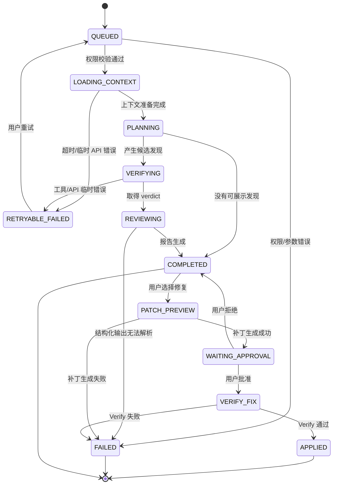
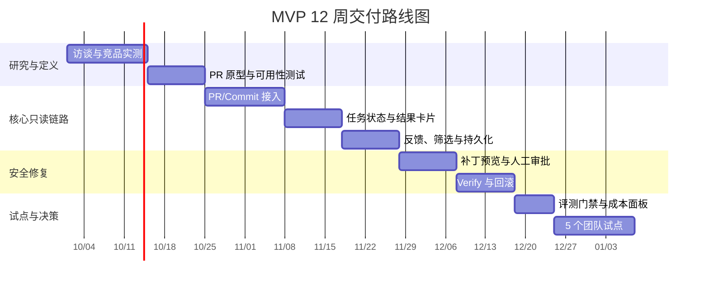

# MVP PRD 与产品路线图

## 1. PRD 摘要

**产品名称**：可信代码审查 Agent

**版本**：MVP v0.1

**目标**：让代码作者和 Reviewer 在一个 PR 内完成“发现问题—核验证据—决定处理—安全生成补丁”的闭环。

**成功条件**：用户愿意把结果当作审查输入，而不是把它当作需要再次审查的噪音源。

## 2. P0 功能范围

### F1. PR/Commit 接入

**描述**：用户授权仓库后选择一个 PR 或 Commit，系统只读取变更文件及必要上下文。

**验收标准**：

- 支持取消、重试和权限不足的明确提示。
- 默认不读取未授权仓库；上下文读取范围在任务开始前展示。
- 同一 commit 重复审查可复用缓存，不重复消耗模型额度。

### F2. 审查任务状态

**描述**：展示排队、读取上下文、分析、验证、生成报告、失败和完成状态。

**验收标准**：

- 用户能看到当前阶段和预计下一步，不展示无意义的内部日志。
- 任务失败时给出可操作原因和重试入口。
- 页面刷新后可以恢复任务状态和报告。

### F3. 发现卡片

**字段**：类别、严重度、文件/行号、问题描述、证据、影响、建议、验证状态、处理状态。

**验收标准**：

- 每条卡片都能跳转到 diff 对应行。
- `CONFIRMED`、`FALSE_POSITIVE`、`UNCERTAIN` 有清晰视觉区别。
- 默认按风险排序，但允许按文件和状态筛选。
- 用户可标记采纳、忽略、误报或稍后处理，并记录原因。

### F4. 补丁预览与审批

**描述**：针对已确认问题生成完整 diff，用户审批后才允许写入分支或创建 commit。

**验收标准**：

- 写入前展示变更文件、增删行和潜在影响。
- 任何写入均有操作者、时间、任务 ID 和回滚信息。
- 用户拒绝或 Verify 失败时，仓库原文件不被修改。

### F5. Verify 结果

**描述**：对补丁执行语法检查、已有测试或配置的校验命令。

**验收标准**：

- 每个修复显示“验证通过/失败/未配置”。
- 验证命令来自允许列表，不能由模型任意扩大权限。
- 失败结果可回到具体补丁，不把失败伪装为修复成功。

## 2.1 用户故事与优先级

| 编号 | 用户故事 | 验收重点 | 优先级 |
|---|---|---|---|
| US-01 | 作为代码作者，我希望只审查本次 PR 变更，避免等待全仓库扫描 | 变更文件和上下文范围可见 | P0 |
| US-02 | 作为 Reviewer，我希望按风险和证据快速筛选发现 | 严重度、状态、文件筛选可用 | P0 |
| US-03 | 作为代码作者，我希望知道为什么这条发现可信 | 行号、上下文、验证动作可回溯 | P0 |
| US-04 | 作为 Reviewer，我希望先看到补丁再决定是否写入 | 完整 diff、审批人和回滚信息 | P0 |
| US-05 | 作为平台管理员，我希望限制模型和工具权限 | 最小权限、命令白名单和审计 | P0 |
| US-06 | 作为研发经理，我希望知道工具是否真的减少返工 | 采纳、误报、时延、成本趋势 | P1 |

## 2.2 发现卡片字段规格

| 字段 | 类型 | 必填 | 说明与约束 |
|---|---|---:|---|
| `finding_id` | 字符串 | 是 | 全局唯一，跨重试保持不变 |
| `file_path` | 字符串 | 是 | 必须位于用户授权仓库范围内 |
| `line_start/line_end` | 整数 | 是 | 指向变更或必要上下文，越界时降级为文件级 |
| `category` | 枚举 | 是 | `BUG/SECURITY/PERF/STYLE`，可扩展但需版本化 |
| `severity` | 枚举 | 是 | `High/Medium/Low`，由模型建议、规则校准 |
| `description` | 文本 | 是 | 描述现象和影响，不写未经证据支持的因果 |
| `evidence` | 列表 | 是 | 代码片段、调用关系、验证命令或失败输出 |
| `suggestion` | 文本 | 是 | 给出最小可行修复方向，不承诺一定适用 |
| `verdict` | 枚举 | 是 | `CONFIRMED/FALSE_POSITIVE/UNCERTAIN` |
| `status` | 枚举 | 是 | `OPEN/ACCEPTED/IGNORED/FIXED/FAILED` |
| `trace_id` | 字符串 | 是 | 关联一次审查任务的遥测事件，不暴露内部密钥 |

## 2.3 任务状态机

## 2.4 端到端验收用例

| 用例 | 前置条件 | 操作 | 预期结果 |
|---|---|---|---|
| 正常只读审查 | 仓库授权、PR 有变更 | 启动审查并等待完成 | 任务完成，发现可跳转，报告可刷新恢复 |
| 无权限 | 用户无目标仓库读取权限 | 选择 PR | 不读取代码，展示申请权限或更换仓库入口 |
| 结果解析失败 | 注入畸形 FINDING/VERDICT | 启动审查 | 不产生正式发现，记录失败类别，可重试 |
| 模型临时错误 | 模拟 429/5xx | 启动审查 | 有限重试、状态可见、不会重复扣费失控 |
| 修复验证失败 | 补丁导致测试失败 | 审批补丁 | 标记失败，不应用到目标分支，保留 diff 和输出 |
| 重复提交 | 同一 commit 重复触发 | 再次启动 | 命中缓存或明确说明重新计算原因 |

## 2.5 权限矩阵

| 动作 | 代码作者 | Reviewer | 平台管理员 | 默认策略 |
|---|---:|---:|---:|---|
| 查看审查结果 | ✓ | ✓ | ✓ | 仅授权仓库成员 |
| 标记采纳/误报 | ✓ | ✓ | ✓ | 写入反馈事件 |
| 生成补丁 | ✓ | ✓ | ✓ | 只生成，不写入 |
| 批准写入 | - | ✓ | ✓ | 明确确认 + 审计 |
| 修改仓库规则 | - | - | ✓ | 组织级权限 |
| 查看成本与遥测 | 部分 | 部分 | ✓ | 脱敏后按角色展示 |

## 2.6 数据与审计要求

- 任务输入保存仓库 ID、PR/Commit、revision、权限范围和上下文策略，不默认保存完整源代码。
- 每个发现和补丁都关联 `task_id`、`trace_id`、操作者、时间、模型版本和提示词版本。
- 原始工具输出按保留策略过期清理；敏感字段先脱敏再进入日志。
- 任何写入动作必须能回答“谁在什么时候批准了什么 diff，Verify 用了什么命令，结果是什么”。

## 3. P1/P2 范围

| 版本 | 目标 | 功能 |
|---|---|---|
| P1 | 进入团队工作流 | GitHub/GitLab App、Webhook、CI 门禁、仓库规则、团队反馈、趋势看板 |
| P2 | 企业化与规模化 | SSO/SCIM、私有化部署、组织审计、数据保留策略、多模型路由、预算控制 |
| P3 | 平台化 | 自定义 Agent Skill、规则市场、跨仓库知识库、开放 API 与生态集成 |

## 4. 关键交互原则

- **先结论后证据**：卡片第一屏说明风险和建议，展开后查看证据链。
- **不隐藏不确定性**：模型无法确认时展示“不确定”，不要强行给出肯定结论。
- **渐进式授权**：只读、生成补丁、写入分级授权，危险动作永远需要明确确认。
- **可逆操作**：忽略可以恢复，补丁可以撤销，任务可以重跑，历史结果可追溯。
- **增量优先**：默认审查变更，不重复扫描整个仓库，减少等待和成本。

## 5. 典型异常与降级

| 异常 | 用户可见行为 | 系统策略 |
|---|---|---|
| 模型 429/5xx | 显示排队/重试，不丢失任务 | 指数退避、模型降级、保留事件日志 |
| 工具调用参数错误 | 标记该发现待复核 | schema 校验、限制重试次数 |
| 结果解析失败 | 不展示为正式发现 | 记录失败类别，进入人工/规则兜底 |
| 上下文超限 | 提示缩小变更范围 | 分块、摘要、增量读取 |
| Verify 失败 | 修复状态为失败，不允许自动应用 | 保留 diff 和命令输出 |
| 用户权限不足 | 明确说明所需权限 | 最小权限申请，不自动扩大范围 |

## 6. 发布门槛

发布前必须同时满足：

1. 结果层：关键评测集 Precision 达标，且没有高危安全回归。
2. 轨迹层：工具错误、解析失败、死循环和写入失败均可观测、可归因。
3. 体验层：新用户可在 5 分钟内完成一次只读审查；任务失败可自行重试。
4. 安全层：默认只读，敏感字段脱敏，写入和命令执行有审批与审计。

## 7. 12 周路线图

| 周期 | 交付 | 退出条件 |
|---|---|---|
| 第 1～2 周 | 访谈、竞品实测、PR 接入原型 | 形成 P0 场景和可用性基线 |
| 第 3～5 周 | PR/Commit 接入、任务状态、发现卡片 | 端到端只读流程可用 |
| 第 6～7 周 | 反馈、过滤、证据链和结果持久化 | 用户可完成判断并留下反馈 |
| 第 8～9 周 | 补丁预览、审批、Verify | 写入全程可回滚，验证结果可信 |
| 第 10 周 | 评测门禁、成本/延迟面板 | 质量和成本可量化 |
| 第 11～12 周 | 5 个团队试点与复盘 | 决定 P1 是否进入开发 |

### 路线图依赖关系

路线图中的日期是规划示例，不是项目已承诺的排期；真正排期要结合工程人数、GitHub/GitLab 权限审批和模型服务稳定性重新估算。
