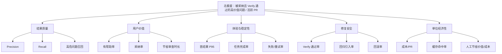

# 指标体系与实验方案

## 1. 指标原则

AI 代码审查不能只看“生成了多少条评论”。指标需要同时回答四个问题：结果是否正确、用户是否采纳、系统是否稳定、单位成本是否可接受。

## 2. 指标树

```text
北极星指标：被用户采纳且 Verify 通过的高价值问题数 / 活跃 PR
├── 结果质量：Precision、Recall、F1、高危问题召回率
├── 用户价值：有帮助率、采纳率、误报率、节省审查时长
├── 工作流体验：首结果时延、任务完成率、重试率、反馈率
├── 修复安全：补丁应用率、Verify 通过率、回归引入率、回滚率
└── 经营效率：Token/PR、成本/PR、缓存命中率、单位活跃团队成本
```



## 3. 核心指标定义

| 指标 | 定义 | 目标/用法 |
|---|---|---|
| Precision | TP / (TP + FP) | 判断用户看到的结果是否可信；高风险场景优先保证 |
| Recall | TP / (TP + FN) | 判断漏报；需按问题类型分层，不能只看总平均 |
| 有帮助率 | 用户标记“有帮助”的发现 / 有反馈发现 | 目标 ≥ 60%，观察趋势 |
| 采纳率 | 被修复或被标记处理的确认问题 / 确认问题 | 反映是否进入真实工作流 |
| 首结果时延 | 任务开始至第一条可判断结果 | MVP P95 ≤ 5 分钟 |
| Verify 通过率 | 通过验证的应用补丁 / 应用补丁 | 自动修复发布门槛，目标 ≥ 90% |
| 回归引入率 | 修复后新增失败 / 已应用修复 | 必须持续接近 0 |
| 成本/PR | 模型与基础设施成本 / 完成审查 PR | 做模型路由与定价决策 |

项目已有 124 条标注样本和节点/故障评估基础。2026-09-27 replay 已扫描 124/124，但其中 3 条 API_ERROR 被 runner 计入 FN；报告同时保留运行口径与排除 API_ERROR 的模型响应口径。它仍是单次、单数据集评测，不能等同于真实用户价值或跨仓库泛化能力。

## 3.1 指标口径、分母与切片

| 指标 | 分子 | 分母 | 必须切片 |
|---|---|---|---|
| Precision | 被标注为真实问题的展示发现 | 所有被展示发现 | 严重度、问题类型、语言、模型 |
| Recall | 被发现的真实问题 | 标注集中的真实问题 | 严重度、语言、上下文策略、代码位置 |
| 有帮助率 | 用户选择“有帮助” | 有明确反馈的发现 | 用户角色、仓库、问题类别 |
| 采纳率 | 被修复或确认处理的问题 | 被确认的问题 | 严重度、作者/Reviewer、模型版本 |
| 首结果 P95 | 各任务首结果时延的 95 分位数 | 已完成且有时间戳的任务 | PR 大小、队列长度、模型 |
| Verify 通过率 | 通过验证的补丁 | 已执行验证的补丁 | 语言、测试类型、修改文件数 |
| 回归引入率 | 修复后新增失败的补丁 | 已应用且完成回归检查的补丁 | 修复类别、测试覆盖、模型 |

任何指标没有分母、样本量、时间窗口和版本号时，只能算观察值，不能作为发布决策依据。

## 4. 埋点方案

### 事件

`review_started`、`context_loaded`、`finding_presented`、`finding_feedback`、`patch_previewed`、`patch_approved`、`verify_finished`、`review_completed`、`review_failed`。

### 公共字段

`task_id`、`repo_id`、`pr_id`、`commit_sha`、`model`、`agent_role`、`risk_level`、`latency_ms`、`token_usage`、`permission_scope`、`failure_category`。

不要记录完整源代码和密钥；日志中使用仓库/文件哈希或脱敏标识。指标口径必须固定版本，避免模型升级后无法解释趋势变化。

## 5. 实验一：证据卡对信任的影响

**问题**：展示“自然语言评论”还是“评论 + 代码证据 + 验证动作”更能促进采纳？

**设计**：同一批标注问题随机分为 A/B 两组。A 只展示评论与建议；B 额外展示文件行号、最小上下文、验证状态和跳转入口。

**主要指标**：判断正确率、完成时长、有帮助率、采纳率、用户信心评分。

**成功标准**：B 组判断正确率提升至少 10%，且完成时长不增加 20% 以上。若信息过载导致时长显著上升，改为默认折叠证据、按需展开。

## 6. 实验二：自动修复授权策略

**问题**：生成补丁、创建分支、直接写入三种授权方式如何影响转化与安全？

**设计**：先在低风险、脱敏仓库进行组间测试；所有组都保留完整回滚能力。

**主要指标**：补丁预览率、审批率、Verify 通过率、回滚率、信任评分。

**决策规则**：如果直接写入的审批率提升但回滚率超过阈值，则默认退回“生成补丁 + 人工审批”；安全指标优先于短期转化。

## 7. 实验三：保守模型与激进模型路由

项目已有评估呈现 Precision/Recall 取舍。可按仓库风险、语言和任务类型分层测试：安全敏感仓库优先高 Precision 模型；探索性审查允许更高 Recall，但必须降低阻塞级别。

记录模型版本、提示词版本、上下文策略和价格版本，避免把模型变化误判为产品交互效果。

## 8. 质量门禁建议

- 高危问题：Precision 门槛高于普通问题，任何高危误报/漏报进入人工复核。
- 阻塞合并：只允许稳定、可解释、可回归验证的规则触发。
- 自动修复：必须 Verify 通过，且不能出现新增测试失败或权限越界。
- 评测发布：离线故障集、真实抽样、历史趋势三者均无关键回归才发布。

## 9. AI 评测分层

```mermaid
flowchart LR
    D[评测数据] --> R[结果层]
    D --> T[轨迹层]
    D --> E[效率成本层]
    D --> S[稳定性层]
    R --> R1[Precision/Recall/F1]
    R --> R2[高危召回/严重度校准]
    T --> T1[Plan 可执行率]
    T --> T2[工具成功率/参数合法率]
    T --> T3[VERDICT 解析率/循环率]
    E --> E1[延迟 P50/P95]
    E --> E2[Token/任务与成本/PR]
    S --> S1[pass@k]
    S --> S2[flaky 率/结果方差]
    R1 --> G[发布决策]
    T1 --> G
    E1 --> G
    S1 --> G
```

分层的原因是：结果指标回答“错没错”，轨迹指标回答“错在哪”，效率指标回答“是否值得”，稳定性指标回答“是否能重复得到”。任何一层明显退化都不能被另一层的好看分数抵消。

## 10. 评测集设计

| 数据集 | 目标 | 当前/规划状态 | 发布用途 |
|---|---|---|---|
| 标注主链路 | 衡量问题检出质量 | 已有 124 条样本；2026-09-27 replay 完成 124/124，3 条 API_ERROR 需与模型判断分开解释 | 模型和 Prompt 对比；仍需重复运行、版本锁定和标注复核 |
| FP 陷阱 | 衡量误报控制 | 已有 16 条 | 阻塞合并前的 Precision 门槛 |
| 边界集 | 空目录、大文件、CJK、二进制、深层目录 | 规划中 | 回归与兼容性 |
| 故障注入集 | 解析失败、未知工具、429、超时、循环 | 离线 10 条已验证 | CI 轨迹门禁 |
| 修复质量集 | 补丁可应用、测试通过、无回归 | 尚需补充 | 开启自动修复前的门槛 |

## 11. 统计与决策规则

- 小样本结果必须同时展示样本数和置信区间；不因一次运行的提升就宣布模型更好。
- A/B 实验先定义主要指标和护栏指标，再看结果；主要指标只能有一个，避免事后挑选。
- 结果按模型版本、提示词版本、评测集版本锁定，变更时生成新基线。
- 当高危问题出现单次漏报或错误修复时，先进入人工复核，不用整体平均值掩盖尾部风险。

## 12. 实验分析模板

```text
实验名称：
决策问题：
主要指标与分母：
护栏指标：
实验人群/样本：
对照与实验差异：
最小样本与运行周期：
成功标准：
停止规则：
结果与置信区间：
最终决策：上线 / 延长观察 / 回滚 / 调整假设
```
