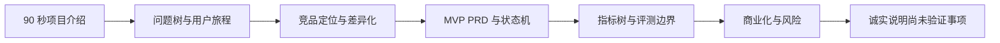

# 面试讲述稿

## 1. 90 秒项目介绍

我做的是一个面向研发团队的 AI 代码审查 Agent。最初的问题不是“让模型多写几条评论”，而是如何让它在真实代码仓库中稳定完成发现、验证、汇总和修复，同时避免误报和不安全写入。项目采用 Planner、Executor、Reviewer、Fixer、Verify 的多 Agent 流程：先提出候选问题，再用独立 Agent 验证证据，最后汇总报告；修复必须经过人工确认和验证。除了 Streamlit、CLI 和 API 入口，我还补了权限、限流、缓存、遥测和评测体系。已有评估显示不同模型在 Precision 和 Recall 上有明显取舍，因此产品上我把“证据链、风险分级、人工审批和质量指标”作为核心，而不是把模型输出直接当结论。下一步会把本地分析产品化为 PR 原生工作流，用真实用户反馈验证哪些发现真正能节省审查时间。

## 2. STAR 项目故事

**Situation**：代码审查既影响交付速度，也容易被重复性问题占满；单轮代码问答无法证明发现是否真实。

**Task**：设计一个可解释、可验证、可控写入的 AI 代码审查闭环，并建立可复现的质量评估。

**Action**：把任务拆成 Planner/Executor/Reviewer/Fixer/Verify；为工具调用加入权限分级和沙箱；用遥测记录节点、工具和失败类型；用标注集、故障注入和成本指标评估模型与流程；把现有能力抽象成 PR 产品需求，优先做只读审查和证据卡。

**Result**：形成可运行的多 Agent 系统和产品化路线；124 条标注样本的 2026-09-27 replay 已全部扫描，运行口径 Precision=95.3%、Recall=38.0%、F1=0.54，其中 3 条 API 超时被 runner 按 FN 计入；排除这 3 条 API_ERROR 后，模型响应口径 Recall=39.0%、F1=0.55。这个结果是单次评估而非真实客户价值证明，也明确了从本地原型到企业产品的差距。

## 3. 高频追问与回答方向

### 为什么不是直接用一个 Agent？

因为“发现”和“确认”目标不同。发现阶段希望覆盖面广，确认阶段希望证据充分；拆分后可以分别调模型、做并行验证和定位失败。代价是编排复杂、延迟和成本增加，所以必须用指标证明多 Agent 带来的质量收益。

### 你如何处理误报和漏报？

先把它们拆成不同风险：误报损害信任，漏报影响覆盖。用标注集分别计算 Precision/Recall，按问题类型和模型分层；产品上把未经确认的发现标记为候选，不直接阻塞合并，并把用户反馈沉淀为回归样本。

### 为什么自动修复不默认开启？

代码写入是不可逆风险更高的动作。先展示 diff，再请求审批，最后执行 Verify；只有通过验证的补丁才允许应用，并保留回滚和审计记录。

### 这个项目的用户是谁？

首个 ICP 是有 PR 流程、但没有专职质量平台团队的中小研发组织。代码作者和 Reviewer 是日常用户，研发经理是价值决策者，平台/安全人员是采用门槛的把关者。

### 你会如何判断项目成功？

不只看模型分数。北极星指标是“被用户采纳且 Verify 通过的高价值问题数 / 活跃 PR”；同时看误报、有帮助率、首结果时延、成本/PR 和回归率。没有真实使用数据前，我会明确说这是目标指标而不是结果。

## 4. 必须主动说明的边界

- 当前实现的主入口是本地路径、CLI、API 和 Streamlit，GitHub/GitLab PR 接入属于规划。
- 公开竞品分析需要补充实际试用日期与价格，不应把功能推测写成事实。
- 现有评测是工程质量基线，不等同于真实客户 ROI；客户价值需要通过访谈和试点验证。
- 评估结果受模型版本、仓库类型、提示词和样本分布影响，面试中应说明口径。

## 5. 三分钟完整讲述版本

### 背景与问题

代码审查既是质量控制点，也是研发交付中的等待点。人工 Reviewer 会被重复性问题消耗，而单轮 LLM 评论存在误报、漏报、证据不足和自动修改失控的问题。所以我把问题定义为：如何让 AI 在真实仓库约束下，稳定完成“发现—验证—决策—修复—回归”，并让用户始终知道依据和风险。

### 产品选择

我没有把它做成泛化聊天机器人，而是定位成 PR 工作流里的可信代码审查 Agent。第一阶段只做变更集审查和证据卡，默认只读；用户确认后才生成补丁，补丁必须经过 Verify。这样可以把价值聚焦在合并决策，而不是展示模型能聊多久。

### 方案与取舍

系统用 Planner 发现候选问题、Executor 独立验证、Reviewer 去重和分级、Fixer 生成修复、Verify 检查结果。多 Agent 增加了成本和编排复杂度，但换来了职责隔离、并行验证和更好的失败归因。产品上不暴露内部 Agent 术语，只呈现发现、证据、状态和操作。

### 评测与边界

项目有标注集、故障注入、轨迹遥测和成本指标。124 条标注样本已有完整扫描结果，但 2026-09-27 的 3 条 API 超时被当前脚本计作 FN，且尚无重复运行和跨仓库对照，因此只能报告本次运行口径，不能宣称稳定或可泛化的模型基线；GitHub/GitLab PR 接入和真实客户 ROI 仍属于下一阶段验证。这个边界很重要，因为 AI 产品的可信度不仅来自结果，也来自是否诚实说明样本和评测口径。

### 下一步

先完成目标用户访谈和同一脱敏 PR 的竞品实测，再做只读 PR 原型；用有帮助率、误报率、首结果 P95、采纳率和 Verify 通过率判断是否进入自动修复和 CI 阻塞。

## 6. 产品经理决策记录示例

| 追问 | 我的决策 | 依据 | 代价 | 后续验证 |
|---|---|---|---|---|
| 为什么先做 PR 而不是 IDE？ | 先做 PR 增量审查 | 更靠近合并决策，范围和成本可控 | 即时反馈较弱 | 访谈比较 PR 与 IDE 的高频场景 |
| 为什么默认只读？ | 生成补丁需审批 | 写入风险高，已有 Fixer/Verify 可承接 | 少一步自动化收益 | 测试审批率、回滚率、Verify 通过率 |
| 为什么不直接让模型给置信度？ | 置信度只做辅助，不当真值 | LLM 自报置信度未必校准 | 需要额外规则和评测 | 按问题类型做置信度校准 |
| 为什么不先做大而全？ | 先守住高价值问题与可信闭环 | 误报会损害信任，资源有限 | 覆盖范围较窄 | 按反馈扩展语言和问题类型 |

## 7. 面试展示顺序

## 8. 反问面试官的问题

1. 团队当前更看重 AI 产品的用户增长、模型效果、商业化，还是平台治理？
2. 对代码/企业数据类产品，团队通常如何定义可上线的安全和评测门槛？
3. 产品经理是否参与评测集、线上实验和故障复盘，还是主要负责需求与项目推进？
4. 这个岗位会接触真实用户访谈和售前试点吗？成功标准如何被量化？
