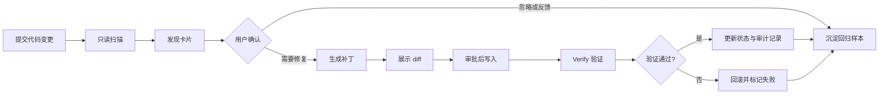

# 项目决策记录

本文记录 AI 代码审查 Agent 从工程原型走向可验证产品方案时的关键判断。每项决策都区分已有事实、产品假设、取舍和后续验证，避免把规划内容误写成已经实现的能力。

## 1. 项目定位

面向使用 GitHub/GitLab 协作的研发团队，提供有证据、可解释、可控修复的 AI 代码审查能力。产品目标不是生成更多评论，而是帮助团队在合并前更早识别高风险问题，并降低重复审查成本。

当前仓库已经具备本地路径、CLI、FastAPI 和 Streamlit 入口，以及多 Agent 编排、工具执行、权限控制、遥测和评测基础。GitHub/GitLab PR 原生接入、团队协作和持续商业化仍属于产品化规划。

## 2. 核心用户与价值

| 用户角色 | 主要任务 | 当前痛点 | 产品价值 |
|---|---|---|---|
| 代码作者 | 提交变更并处理反馈 | 反馈到达晚，重复问题多 | 在合并前获得按证据组织的风险提示 |
| Reviewer | 判断变更是否可合并 | 需要反复确认低价值问题 | 先看高风险发现和证据，减少重复检查 |
| 研发负责人 | 管理交付质量和效率 | 难以比较审查质量与成本 | 通过指标和趋势判断是否值得推广 |
| 平台/安全人员 | 控制数据、权限和写入风险 | AI 工具可能越权或误改代码 | 通过审批、沙箱、审计和回滚控制风险 |

## 3. 关键产品决策

| 决策问题 | 当前选择 | 依据 | 代价 | 后续验证 |
|---|---|---|---|---|
| 先做 PR 还是 IDE | 优先做 PR 增量审查 | 更靠近合并决策，输入范围和结果边界清晰 | 即时反馈弱于 IDE | 对比 PR 与 IDE 的高频场景和使用频率 |
| 默认只读还是自动修改 | 默认只读；修改需要审批 | 代码写入风险高，必须能查看 diff、验证并回滚 | 自动化链路多一步确认 | 观察审批率、回滚率和 Verify 通过率 |
| 单 Agent 还是多 Agent | 使用发现、验证、汇总、修复、验证的分工流程 | 发现追求覆盖，验证追求证据，职责隔离有利于归因 | 增加延迟、Token 消耗和编排复杂度 | 按相同样本比较质量收益与单位成本 |
| 是否展示内部角色 | 面向用户展示发现、证据、状态和操作 | 用户关心结果，不需要理解内部编排细节 | 内部调试信息需要单独入口 | 观察用户对证据卡和状态信息的理解度 |
| 是否提供模型自报置信度 | 只作辅助信息，不作为真值 | LLM 自报置信度未必校准 | 需要额外规则解释置信度 | 按问题类型做校准并和用户反馈对照 |
| 如何处理低置信发现 | 标记为候选，不直接阻塞合并 | 误报会损害信任，阻塞应有更高证据门槛 | 部分问题不能自动进入强提醒 | 观察采纳率、有帮助率和误报率 |

## 4. 用户体验闭环

产品上应把内部 Agent 流程收敛成四个用户可理解的状态：待确认、已确认、修复中、已验证。每张发现卡至少包含问题描述、代码位置、证据、风险等级、建议动作和验证状态。

## 5. 事实与假设边界

### 已有事实

- 仓库包含多 Agent 编排、工具调用、权限控制、沙箱、遥测和评测代码。
- 评测数据共 124 条，2026-09-27 replay 已完成 124/124 扫描。
- 该次运行口径为 Precision 95.3%、Recall 38.0%、F1 0.54，其中 3 条 API_ERROR 被当前脚本计入 FN。
- 旧日志中存在大量未收尾运行，属于历史采集覆盖缺口；不能反向解释为模型能力结论。

### 待验证假设

- 研发团队愿意在合并前查看证据卡，而不是只接受一句结论。
- “默认只读 + 审批后修复”能够在安全性和效率之间取得可接受平衡。
- 多 Agent 的额外成本能够换来更高的高价值问题采纳率。
- 真实 PR 场景中的有帮助率和节省时间，能够超过本地评测分数对产品决策的影响。

## 6. 指标与决策门槛

| 指标 | 定义 | 用途 |
|---|---|---|
| 高价值问题采纳率 | 被用户采纳且 Verify 通过的问题数 / 活跃 PR | 判断产品是否产生实际价值 |
| 有帮助率 | 用户标记为有帮助的发现数 / 用户反馈总数 | 判断发现是否值得信任 |
| Precision | 正确发现数 / 全部发现数 | 控制误报和信任损耗 |
| Recall | 正确发现数 / 标注问题总数 | 衡量覆盖能力 |
| 首结果 P95 | 从任务提交到首张发现卡的 95 分位耗时 | 控制等待体验 |
| 成本/PR | 单个 PR 的模型与基础设施成本 | 支持模型和套餐选择 |
| 回归率 | 修复后新增失败或破坏行为的比例 | 控制自动修复风险 |

在真实用户数据建立前，上述指标只能作为目标和实验设计，不能写成已达成结果。

## 7. 后续验证顺序

1. 对目标用户开展匿名访谈，确认高频审查场景、误报容忍度和审批意愿。
2. 使用同一份脱敏 PR 完成竞品实测，记录发现质量、证据表达、首结果时延和价格。
3. 上线只读 PR 原型，先观察发现卡查看率、反馈率和有帮助率。
4. 在安全门槛通过后开放审批式修复，观察 Verify 通过率、回滚率和节省时间。
5. 使用至少三个团队的两周试点数据更新商业化判断，不用单次 replay 结果替代客户价值证据。
