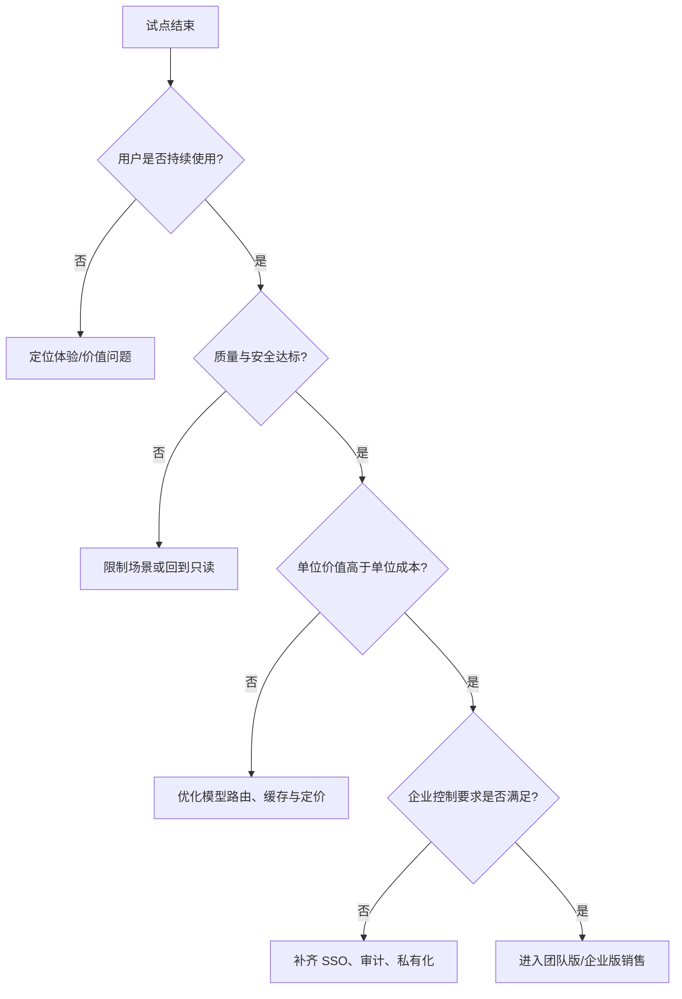

# 商业化与风险评估

## 1. 商业化假设

首阶段不追求覆盖所有开发者，而是服务“代码敏感、审查量稳定、又缺少专职质量平台”的研发团队。价值应以节省高级工程师审查时间、降低高风险缺陷进入主干的概率和减少修复往返来证明。

## 2. 付费对象与包装

| 方案 | 适用客户 | 核心能力 | 计费假设 |
|---|---|---|---|
| 试用版 | 个人/小团队 | 有限 PR、只读审查、基础报告 | 免费，用于验证激活与留存 |
| 团队版 | 20～300 人研发团队 | 团队规则、反馈闭环、CI 门禁、趋势面板 | 按活跃开发者或 PR 量计费，需真实成本测算 |
| 企业版 | 对数据边界和审计有要求的组织 | 私有化、SSO、审计、模型路由、SLA | 年度合同或私有化服务费 |

当前不应直接承诺具体价格。模型调用、上下文长度、缓存命中率、部署与支持成本尚未通过真实试点测算，先验证“愿意持续使用”和“谁愿意付费”。

## 3. 获客与试点路径

1. 用本地/自托管版本吸引对代码隐私敏感的技术团队。
2. 以一个真实仓库做两周试点，先只读、不阻塞合并。
3. 复盘误报、采纳、节省时间、成本和安全问题，形成团队案例。
4. 在有稳定质量与使用数据后，再销售 CI 门禁、团队治理和企业部署。

## 4. 风险登记表

| 风险 | 触发信号 | 影响 | 缓解措施 | 责任指标 |
|---|---|---|---|---|
| 误报过多 | 用户连续标记误报、关闭集成 | 信任下降、流失 | 置信度分层、默认不阻塞、按仓库规则调优 | 误报率、有帮助率 |
| 漏掉高危问题 | 安全问题被人工发现而 Agent 未发现 | 安全事故 | 高危规则与确定性扫描兜底，人工复核 | 高危召回率 |
| 自动修复引入回归 | Verify 失败或回滚增加 | 生产风险 | 只生成补丁、审批、测试、回滚、审计 | 回归引入率 |
| 源代码泄露 | 供应商或日志出现敏感内容 | 合规与商业损失 | 脱敏、最小权限、私有化、日志不存原文 | 数据外发事件 |
| 成本失控 | Token/PR、重试和并发上升 | 毛利下降 | 缓存、增量上下文、模型路由、预算阈值 | 成本/PR、缓存命中率 |
| 平台依赖 | GitHub/GitLab 权限或 API 政策变化 | 接入中断 | 适配层、CLI/API 旁路、契约测试 | 接入成功率 |
| 结果不可解释 | 用户无法判断依据 | 采纳下降 | 证据链、验证动作、原始 diff 和状态留存 | 结果可追溯率 |

## 5. Go / No-Go 决策

**Go**：至少 3 个试点团队连续使用两周；有帮助率、误报率和首结果时延达到目标；没有高危安全事件；客户愿意扩大 PR 范围或讨论付费。

**No-Go 或调整方向**：用户只把结果当作一次性问答、重复使用率低、误报持续造成阻塞，或单位成本明显高于人工节省价值。此时优先缩窄到安全审查、特定语言或特定框架，而不是继续堆功能。

## 6. 价值与单位经济模型

不在没有真实成本和试点数据时虚构价格，先定义可计算模型：

```text
每个 PR 的 AI 成本
= 输入 Token × 输入单价
 + 输出 Token × 输出单价
 + 重试/工具执行/基础设施分摊
 - 缓存节省

每个 PR 的用户价值
= 节省的 Reviewer 时间 × 该角色小时成本
 + 避免返工的预期价值
 - 用户为验证 AI 结果新增的时间

单位贡献毛利率
= (收入/PR - AI 成本/PR - 变动基础设施成本/PR) ÷ 收入/PR
```

必须按模型版本、PR 规模、是否命中缓存和是否触发修复分层统计；平均成本会掩盖长上下文和重试导致的尾部异常。

## 7. 试点成功标准

| 阶段 | 进入条件 | 观察指标 | 决策 |
|---|---|---|---|
| 体验试用 | 用户完成首次只读审查 | 激活率、首结果时延、任务完成率 | 修复体验阻塞 |
| 质量试点 | 使用同一脱敏或授权仓库两周 | 有帮助率、误报率、采纳率、高危召回 | 判断是否扩大 PR 范围 |
| 价值试点 | 至少 3 个团队持续使用 | 节省时间、返工变化、成本/PR、留存 | 讨论团队版付费 |
| 企业评估 | 平台/安全人员参与 | 数据边界、SSO、审计、SLA、部署成本 | Go/No-Go 企业版 |

## 8. 上线前风险检查清单

### 数据与隐私

- [ ] 用户明确知道读取哪些仓库、文件和上下文。
- [ ] 日志和评测结果不含完整源代码、密钥和个人敏感信息。
- [ ] 模型供应商、数据保留、删除和跨境路径可被管理员查询。
- [ ] 私有化部署的网络出站、模型替换和升级策略有文档。

### 权限与执行

- [ ] 只读审查是默认权限，写入和命令执行需要额外授权。
- [ ] 命令、工具、文件范围有 allowlist 和超时。
- [ ] 写入前展示完整 diff，写入后保留审批人、任务 ID 和回滚点。
- [ ] Verify 失败不会被标记为修复成功。

### 模型与质量

- [ ] 模型、提示词、评测集和价格版本均可追溯。
- [ ] 关键问题有确定性规则或人工复核兜底。
- [ ] 429、5xx、超时、上下文超限、解析失败有可解释降级。
- [ ] 离线故障集、真实抽样和历史趋势没有关键回归。

## 9. 商业化决策树


